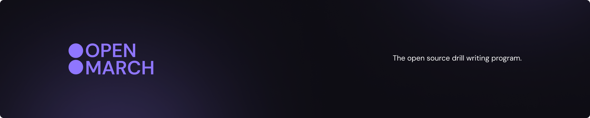

# OpenMarch

OpenMarch is a free, open-source, fast and intuitive drill writing experience for the marching arts.

## Developers

Learn about contributing and running the development server [here](https://openmarch.com/developers/contributing/). Also have a look at our stack on the developer docs.

Join our [Discord](https://discord.gg/eTsQ98uZzq) to interact with the other contributrers and to get support!

### Stack

- **App framework** - Electron
- **Frontend** - React
- **State** - Zustand
- **Styling / UI** - Radix & Tailwind
- **Testing** - Vitest & Playwright

## Users and drill designers

Download the current version of the app on our [website](https://openmarch.com/download/), or the GitHub releases on the sidebar here.

Check out the update videos and posts [here](https://openmarch.com/blog/), to stay up to date with the latest version.

Join our [Discord](https://discord.gg/eTsQ98uZzq) to interact with the community and to get help!

Check out our full [feature list](https://openmarch.com/about/features/) and our [beginner guide](https://openmarch.com/guides/getting-started/) too.

If you're wanting to test the latest and ***unstable*** features, go to the [releases](https://github.com/OpenMarch/OpenMarch/releases) tab on GitHub and download the latest `Pre-release` version displayed. Feel free to give feedback and report bugs in GitHub issues or the Discord.

> Always keep in mind, OpenMarch is still in development. You probably will encounter bugs, issues, and missing features. Help support us grow by contributing or donating!

## License

OpenMarch is written under the [GPL-3.0 license](LICENSE).
All code written for this project will forever and always be open and accessible.
