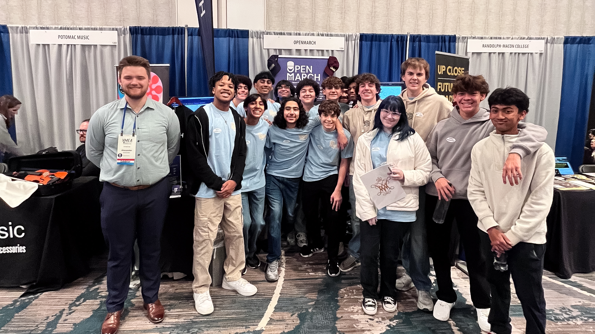

OpenMarch made its debut at the [Virginia Music Educators Association Conference](https://www.vmea.com/), and the response from the music education community was SO overwhelming, but in the best way! For three days, we connected with over 150 educators, students, and performers who were excited to learn how a [free & open source drill writing software](https://openmarch.com/) can support programs around the state of Virginia. VMEA was a major milestone for the OpenMarch team, and we left encouraged and inspired by the enthusiasm surrounding us when chatting at our booth!

## Connecting With Virginia’s Music Education Community

Throughout the week, we chatted with directors and students who stopped by the OpenMarch booth to talk about drill design, see new features, and share how they discovered the software. Many visitors were surprised to learn that OpenMarch will always remain completely free, which sparked meaningful conversations about accessibility and the challenges many programs face when drill design becomes a costly expense, needing to pay a drill writer or purchase expensive software. OpenMarch fills that gap. We also brought a small selection of [OpenMarch merch](https://store.openmarch.com/), and it was amazing to see how quickly it was picked up by directors and students throughout the event!

We spoke with educators from a wide range of high schools and universities, all of whom brought different perspectives on how they use software and applications in their marching band or indoor programs. Several visitors mentioned that they recognized OpenMarch from [YouTube tutorials](https://www.youtube.com/playlist?list=PLQYV6VxuRWjz-1XwK9aDtEvHqdBJunZHn) or social media, which made the in person conversations even more exciting! A fun moment came when a group of percussion students from Lightridge Highschool performing at the conference stopped by to support us before their performance, creating one of the most memorable highlights of the weekend.

## What Directors Loved Seeing in the Software

One of the most common reactions from educators was how easy it is to [customize the field](https://openmarch.com/guides/editing-the-grid/) in OpenMarch. Demonstrating that field sizing can be adjusted in just a few clicks consistently yielded a “wow, that was easy!” Many directors also commented on how clean and intuitive the interface feels, which makes drill writing more accessible and far less intimidating for both new and experienced designers.

We also received a lot of interest in future capabilities, especially mobile tools, cloud sharing, shape features, and simple file sharing for .dots files across devices. These conversations gave us clear insight into the features educators want most from marching band design software, and they will help guide future development!

## A Huge Thank You to the Virginia Community

We are so incredibly grateful to everyone who visited our booth, tried the software, or shared feedback throughout the weekend! VMEA reinforced our mission to keep drill writing and marching band design tools accessible to every program, and the conversations we had in Virginia will continue to shape future updates. We are already preparing for our appearance at the Midwest Clinic, where we will be showcasing new features, connecting with programs from across the country, and continuing the momentum that began at VMEA. If you met us at the conference or want to stay involved with the community, join our Discord, explore our tutorials, or follow along as we get ready for a super exciting week in Chicago!
