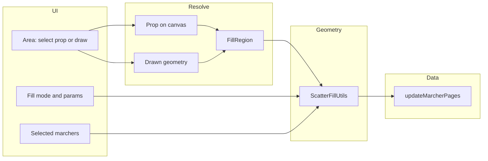

# Feature request: Scatter tool – fill area with performers

**Suggested title for GitHub issue:** `[Feature] Scatter tool: fill prop or drawn area with performers (Even/Grid/Scatter/Perimeter)`

**Suggested labels:** `enhancement`, `desktop`, `props`, `marchers`

---

## Summary

Add a **Scatter tool** that places selected performers inside or along a user-defined area. The area can be chosen by **selecting a prop** or by **drawing a shape** on the canvas. Fill modes (Even / Grid / Scatter / Perimeter) and position-generation logic are shared for both area sources. Reuses existing marcher-position update flow, prop drawing patterns, and shape distribution logic; introduces a small geometry layer and optional canvas context.

---

## Goal

Build a Scatter tool that fills a chosen area with performers. The user picks **which area** to fill, then **how** to distribute (fill mode).

### Area selection (choose one)

- **Select a prop** – Use an existing prop’s shape as the fill region. Requires one selected prop + selected performer marchers.
- **Draw the area** – User draws a shape on the canvas (rectangle, circle, polygon, or freehand) to define the fill region; that drawn shape is used only for this scatter operation (no new prop is created). Flow: activate Scatter tool → choose “Draw area” → pick shape type → draw on canvas → confirm → apply fill with selected marchers.

### Fill modes

- **Even (recommended)** – Low-discrepancy spacing (Fibonacci for rect/ellipse, R₂+triangle for tri/poly). See references below.
- **Grid** – Regular grid inside the shape.
- **Scatter** – Random points inside the shape.
- **Perimeter** – Evenly along the outline.

---

## Current-state summary

- **Props** are backed by marchers (`type: "prop"`) with per-page geometry (`prop_page_geometry`): `shape_type` (rectangle, circle, arc, polygon, freehand) and optional `custom_geometry` (JSON with `points`, `originalWidth`, `originalHeight`, `closed`). Rendered as `CanvasProp` (Fabric Group with `shapeObject`: Rect, Ellipse, Polygon, or Path). `CanvasProp` already exposes `getEdges()` (axis-aligned bounds in pixels) and `getDimensions()`.
- **Performer positions** are `MarcherPage` (`marcher_id`, `page_id`, `x`, `y`) in canvas pixels. Updating is done via `useUpdateSelectedMarchers`; `updateMarcherPages` persists them (with undo).
- **Perimeter distribution** already exists: `StaticMarcherShape.distributeAlongPath` takes `itemIds` and an SVG path string (or ShapePath) and returns `{ id, x, y }[]` with points evenly spaced along the path.
- **Selection**: Props and marchers share `SelectedMarchersContext`; a selected prop appears as a marcher with `type: "prop"`.
- **Canvas access**: The canvas instance is set in App via `onCanvasReady` but is not provided to Inspector or `RegisteredActionsHandler`. The Scatter tool needs the canvas to resolve the selected prop to a `CanvasProp` and, for “draw area”, to attach drawing listeners.

---

## Fill mode details

### Grid fill

- Generate a regular grid (rows × cols or spacing) in the shape’s bounding box, keep only points inside the shape, assign to marchers in order (e.g. row-major).
- Needs: bounds, point-in-shape test (rectangle, circle/ellipse, polygon/path).

### Scatter fill

- Random points inside the shape, optionally with minimum spacing (rejection sampling).
- Same point-in-shape test; optional min spacing as follow-up.

### Quasirandom / low-discrepancy fill (recommended)

- **Rectangles**: Fibonacci lattice in the unit square maps to the bounding rectangle. Formula: \( t_i = (\{i/\varphi\}, (i+0.5)/n) \) for \( 0 \le i < n \), \( \varphi = (1+\sqrt{5})/2 \). Scale to rect; no rejection. Better nearest-neighbor spacing than a regular grid.
  - Ref: [How to evenly distribute points on a sphere (Fibonacci lattice)](https://extremelearning.com.au/how-to-evenly-distribute-points-on-a-sphere-more-effectively-than-the-canonical-fibonacci-lattice/).
- **Circles / ellipses**: Equal-area map from unit square to unit disk: \( (x,y) \to (\theta, r) = (2\pi x, \sqrt{y}) \). Generate points with Fibonacci lattice, map to disk, then scale/transform to the ellipse (and rotation). Same ref as above.
- **Triangles**: R₂ low-discrepancy sequence in the unit square + parallelogram method: for triangle ABC, \( P = r_1 \cdot AC + r_2 \cdot AB \); if \( r_1+r_2 > 1 \), reflect. Order vertices so A is the largest angle to reduce aliasing.
  - Ref: [Evenly distributing points in a triangle](https://extremelearning.com.au/evenly-distributing-points-in-a-triangle/).
- **Polygons (and freehand)**: Triangulate the polygon (e.g. ear-clipping), assign point count per triangle by area, fill each triangle with R₂ + parallelogram method.

### Perimeter fill

- Treat the region’s outline as a path; distribute performers along it using `distributeAlongPath`. Outline path in canvas coords is needed from either CanvasProp (prop source) or built from drawn geometry (drawn source).

---

## Area abstraction: FillRegion

Both “select a prop” and “draw the area” produce a **fill region** that the same pipeline consumes.

- **FillRegion**: Either
  - `{ source: "prop", propId: number }` – resolve at run time via canvas to get `CanvasProp` and its geometry (bounds, outline path, point-in-shape), or
  - `{ source: "drawn", shapeType, centerX, centerY, widthPixels, heightPixels, points?, closed? }` – same geometry format as `PropGeometry` from prop drawing (rectangle, circle, polygon, freehand). Compute bounds, outline path, and point-in-shape with the same pure functions used for props.

A single **fill pipeline** takes: FillRegion + fill mode + selected marchers + pageId + canvas (only when source is prop). It resolves the region to geometry (bounds, outline, pointInShape), runs the chosen position generator (Even/Grid/Scatter/Perimeter), and calls `updateMarcherPages`. Position-generation logic is **region-agnostic**.

**Draw-the-area flow**: Reuse the same drawing UX as props (e.g. `PropDrawingStore` in a “scatter region” mode and `PropDrawingListeners`-style handlers). User picks shape type (rect/circle/polygon/freehand), draws on the canvas; on completion we get a PropGeometry-like payload. That becomes `{ source: "drawn", ... }` and is passed to the fill pipeline; no new prop is created. Optionally show a preview outline until the user confirms or cancels.

---

## Architecture

- **ScatterFillUtils** (new): Pure functions that take **geometry** (bounds, outline path, point-in-shape), not “prop” vs “drawn”. Same code serves both area sources: point-in-shape, grid, quasirandom (Fibonacci/R₂), scatter, and perimeter (reuse `distributeAlongPath`; outline path from CanvasProp or from drawn geometry).
- **Resolve FillRegion to geometry**: For `source: "prop"`, use `CanvasProp` on canvas (`getBoundsInCanvasCoords`, `getOutlinePathInCanvasCoords`, point-in-shape). For `source: "drawn"`, use the same point-in-shape and path-building functions with the drawn shape’s shapeType/points/dimensions.
- **CanvasProp extensions**: Add `getOutlinePathInCanvasCoords()` and ensure bounds in canvas coords; delegate to ScatterFillUtils where possible.
- **Canvas context**: Provide canvas instance (e.g. CanvasContext in App) so the Scatter tool can resolve prop-based regions and attach draw listeners for “draw area”.

---

## Suggested file and UX layout

- **ScatterFillUtils** (e.g. `apps/desktop/src/global/classes/ScatterFillUtils.ts` or `apps/desktop/src/utilities/ScatterFillUtils.ts`): Point-in-shape, grid/scatter/even/perimeter generators; helpers to build outline path and point-in-shape from either CanvasProp or drawn geometry.
- **CanvasProp**: Add `getOutlinePathInCanvasCoords()` and `getBoundsInCanvasCoords()`; delegate to ScatterFillUtils where possible.
- **Canvas context**: e.g. `CanvasContext` in App, set in `onCanvasReady`.
- **Scatter tool UI**: Toolbar or Inspector entry with **Area** (“Use selected prop” or “Draw area”) and **Fill mode** (Even / Grid / Scatter / Perimeter, optional grid params). On confirm: resolve FillRegion to geometry, run position generator, call `updateMarcherPages`.
- **Draw-area flow**: Reuse `PropDrawingStore` and `PropDrawingListeners` in a “scatter region” mode (or parallel store + listeners). When drawing completes, do not create a prop; pass geometry as `{ source: "drawn", ... }` into the fill pipeline. Optional transient preview until confirm/cancel.
- **Placement**: Scatter tool in toolbar or Inspector; optional “Fill with selected marchers” in PropEditor when one prop is selected.

---

## Implementation order

1. **Scatter fill geometry (no UI)** – Point-in-shape (rect, circle, polygon, path); quasirandom generators (Fibonacci, R₂+triangle); grid/scatter fallbacks; helper to build outline path from CanvasProp or drawn geometry; unit tests.
2. **FillRegion and fill pipeline** – Define FillRegion type; `resolveFillRegionToGeometry(region, canvas?)`; single code path for position generation and `updateMarcherPages`.
3. **Canvas context** – Add CanvasContext in App; use in Scatter tool (resolve prop, attach draw listeners).
4. **Scatter tool: “Use selected prop”** – Action/UI: area = selected prop, fill mode + params, selected marchers; resolve, generate positions, `updateMarcherPages`; wire invalidation/undo.
5. **Scatter tool: “Draw area”** – Reuse or mirror prop drawing; on draw complete, pass drawn geometry as FillRegion into fill pipeline; optional preview; no DB write for the shape.
6. **Scatter tool UI** – Tool entry with area choice, fill mode picker, optional grid params; enable rules as above; optional PropEditor shortcut.

---

## Edge cases and notes

- **Multiple pages**: Fill only affects the **current page**.
- **Rotation**: Use actual bounds/geometry in canvas space (including rotation) for both prop and drawn sources.
- **Arc/freehand**: Treat as path for perimeter; for fill use bounding box + point-in-path or approximate with polygon.
- **Draw area then cancel**: If the user cancels (e.g. Escape), clear the drawn shape and do not call the fill pipeline. No persistence of “scatter region” unless we later add “save as prop”.
- **Performance**: Batch the single `updateMarcherPages` call for large marcher counts.

---

## Summary table

| Fill type | Position source                                    | Reuse / new code                                                                                                                                                                                                                                                                                                                                                                       |
| --------- | -------------------------------------------------- | -------------------------------------------------------------------------------------------------------------------------------------------------------------------------------------------------------------------------------------------------------------------------------------------------------------------------------------------------------------------------------------- |
| **Even**  | Fibonacci (rect/ellipse) or R₂+triangle (tri/poly) | New: ScatterFillUtils – Fibonacci in rect/disk; R₂ + parallelogram in triangle; triangulate polygon → per-triangle R₂. Refs: [Fibonacci lattice](https://extremelearning.com.au/how-to-evenly-distribute-points-on-a-sphere-more-effectively-than-the-canonical-fibonacci-lattice/), [Points in a triangle](https://extremelearning.com.au/evenly-distributing-points-in-a-triangle/). |
| Grid      | Grid in bounds, filter by shape                    | New: grid generator + point-in-shape (fallback)                                                                                                                                                                                                                                                                                                                                        |
| Scatter   | Random in bounds, filter by shape                  | New: scatter generator + point-in-shape (fallback)                                                                                                                                                                                                                                                                                                                                     |
| Perimeter | Along outline path                                 | Reuse `distributeAlongPath`; new: outline → path string (prop or drawn)                                                                                                                                                                                                                                                                                                                |

All modes use the same persistence path: `updateMarcherPages` with the current page and the selected marchers’ new coordinates. **Area source** is independent: same fill pipeline whether the region comes from a **selected prop** or a **drawn shape** (FillRegion abstraction + `resolveFillRegionToGeometry`).
