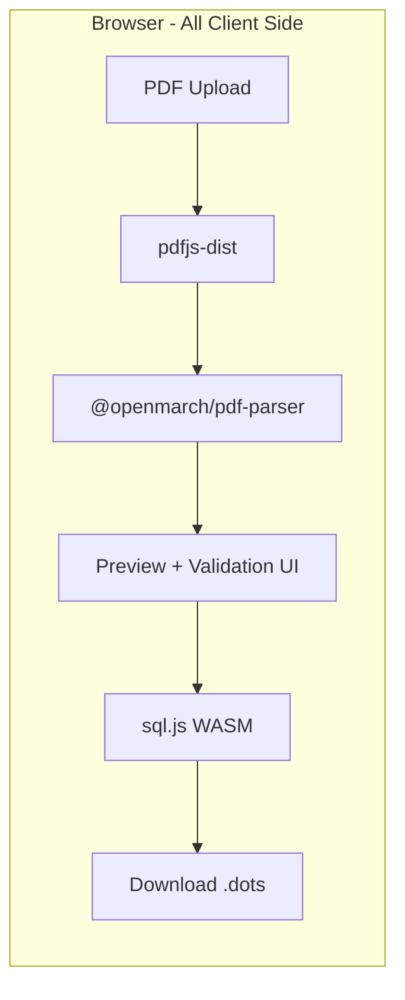

# Feature Request: Web-Based PDF-to-.dots Converter

**Status:** Request  
**Labels:** enhancement, website, importing

---

## Problem

The current PDF coordinate import pipeline requires users to install Python, EasyOCR, poppler, and PyMuPDF for OCR -- all managed through Electron IPC. This is fragile across platforms, slow to set up, and hard to debug. Most Pyware PDFs have selectable text, making the Python OCR dependency unnecessary for the majority of users.

The parsing logic itself (~90% of the pipeline) is already pure TypeScript with no Electron dependencies, but it's locked inside the desktop app.

## Proposed Solution

Build a **fully client-side web tool** hosted on openmarch.com that lets users upload a PDF, preview parsed coordinates, and download a `.dots` file. No server, no Python, no setup.

### Architecture

Everything runs in the browser tab: PDF text extraction (pdfjs-dist), coordinate parsing (shared package), SQLite generation (sql.js WASM), and file download.

## Implementation Phases

### Phase 1: Extract `packages/pdf-parser`

Move the pure parsing logic out of `apps/desktop/src/importers/pdfCoordinates/` into a new shared package. These files have zero Electron dependencies:

- `types.ts`, `tokenizer.ts`, `columns.ts`, `columnTypes.ts`
- `headerDetection.ts`, `coordParser.ts`, `normalize.ts`, `reconcile.ts`
- `parsePage.ts` (text extraction path only), `planBuilder.ts`, `dryRun.ts`
- `index.ts` (refactored: no OCR import, just the pure parse + normalize pipeline)

The desktop app imports from `@openmarch/pdf-parser` and adds its own OCR wrapper on top. `ocr.ts` stays in `apps/desktop/` since it needs Electron IPC.

Dependencies: `pdfjs-dist`, `zod` (already in monorepo).

### Phase 2: .dots File Generator

Build a utility that generates a `.dots` SQLite file in the browser using `sql.js`:

1. Embed the raw SQL from migration files as a bundled string
2. At runtime: sql.js loads WASM, creates in-memory DB, runs migrations
3. Insert data: field_properties, marchers, beats, measures, pages, marcher_pages
4. Export: `db.export()` returns `Uint8Array`, wrap in Blob, trigger download as `.dots`

This avoids needing Drizzle ORM or libsql in the browser -- just raw SQL on top of sql.js.

### Phase 3: Web UI on Existing Astro Site

Add a new page at `apps/website/src/pages/convert.astro` with a `client:only="react"` component:

1. **Upload**: Drag-and-drop or file picker for PDF
2. **Configure**: Pick field type (HS / College / NFL) and hash type
3. **Parse**: Runs `@openmarch/pdf-parser` in-browser, shows progress
4. **Preview**: Table of parsed performers and coordinates with validation warnings/errors
5. **Download**: Generates `.dots` file via sql.js, triggers browser download

## What Gets Dropped (vs. Desktop Import)

- **OCR**: Not included in web version (nice-to-have later via Tesseract.js WASM)
- **Python dependency**: Eliminated entirely
- **IPC**: No Electron IPC needed
- **Direct database writing**: Replaced by sql.js in-browser .dots generation

## Migration Path

1. Build and validate the web converter
2. Link to it from the OpenMarch docs and download page
3. Later: simplify or remove the Electron PDF import, having desktop just open `.dots` files from the web tool

## Risks and Mitigations

- **sql.js WASM bundle size**: ~1MB gzipped. Acceptable for a tool page; lazy-load on the convert route only.
- **pdfjs-dist worker in Astro**: The existing `configurePdfWorker` already handles multiple bundler strategies and should work in Vite/Astro.
- **Schema drift**: When the desktop schema changes, the embedded SQL needs updating. Mitigate with a build script that extracts migrations automatically.

## Acceptance Criteria

- [ ] `packages/pdf-parser` exists with all pure parsing logic, importable by both desktop and web
- [ ] Desktop PDF import still works, importing from the shared package
- [ ] Web page at openmarch.com/convert accepts PDF upload
- [ ] Parsed coordinates are previewed with validation warnings
- [ ] User can download a valid `.dots` file that opens in OpenMarch desktop
- [ ] No server required -- fully static/client-side
