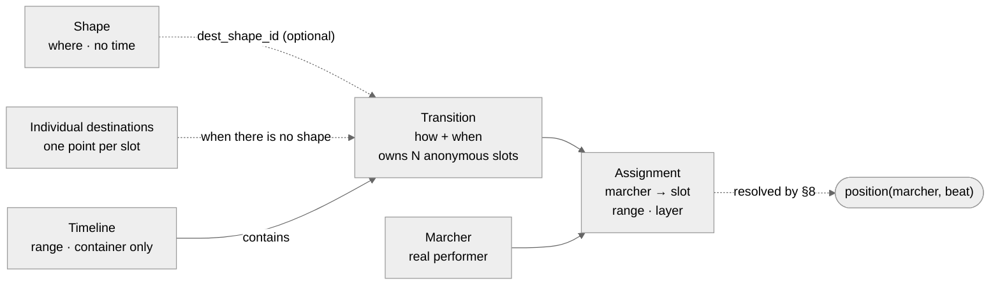
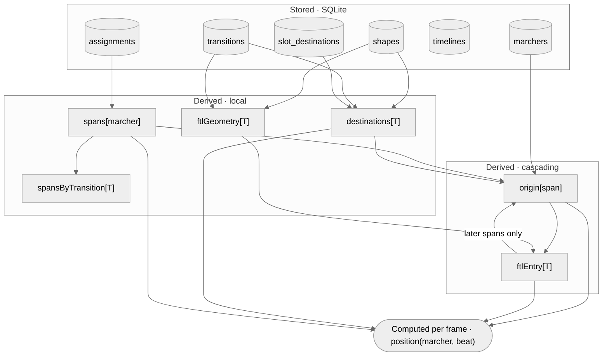
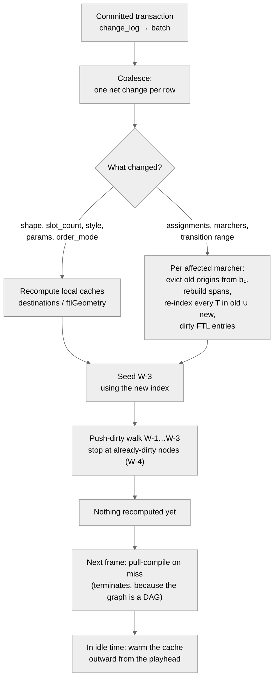
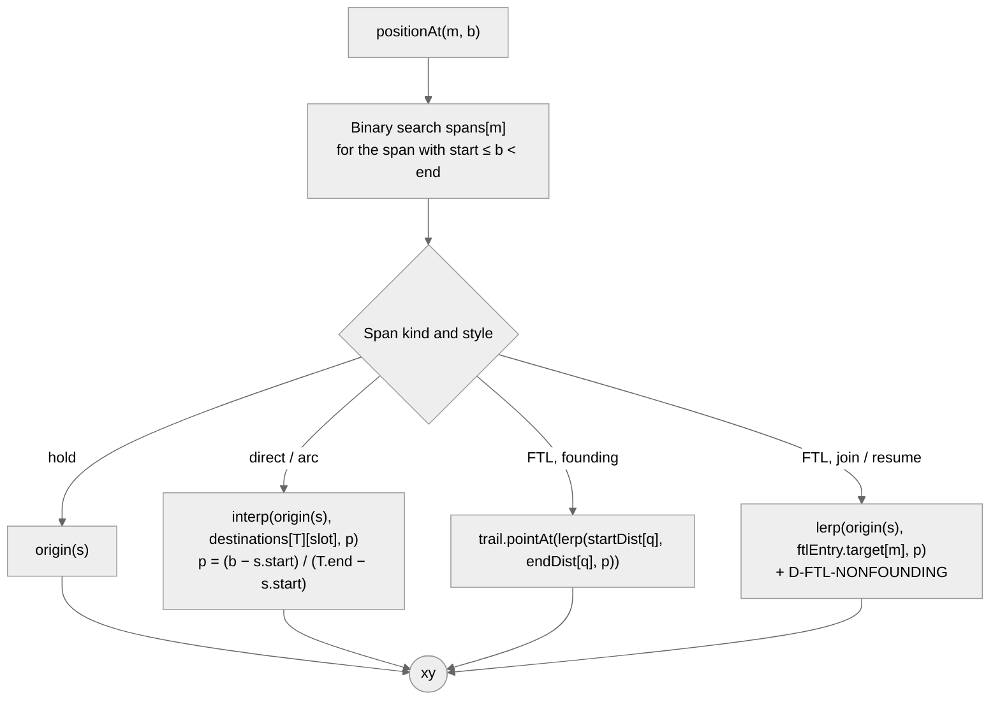

# OpenMarch Timeline Resolution Model: Specification

**Version:** 0.7 (revised after four structural reviews, one design change and one implementation review. Appendices B to E map each review finding to its fix and evidence. Appendix F covers the design change: shapes are optional. Appendix G covers compatibility with the app's undo and redo.)
**Date:** 2026-09-29
**Scope:** The data model and resolution engine behind timelines, shapes, transitions and assignments. It does not cover the editor UI.

---

## 0. How to read this document

This spec is written to be **checked**. Every rule, invariant and test has an ID, and the QA catalogue in §12 refers back to them.

| Prefix | Meaning |
|---|---|
| `D-n` | Design decision (§4) |
| `I-xx` | Invariant on stored data (§6). Violations are rejected on write. |
| `E-xx` | Error code raised when an invariant is violated |
| `R-n` | Normative resolution rule (§8). Together, these define the reference oracle. |
| `W-n` | Invalidation rule (§9) |
| `U-n` | Undo-safety rule for the schema (§6.1) |
| `P-n` | Property that must hold for every valid dataset (§12.5) |
| `D-XXXX` (caps) | Runtime diagnostic, a warning or info message that is not an error (§8.9) |
| `QA-…` | Test case (§12) |

**Status tags.** Each section is marked with one of these:

- **[Decided]**: settled in the design discussion.
- **[Proposed]**: introduced here to make the model complete and testable. It needs sign-off.
- **[Open]**: an unresolved question (§13).

**Keywords.** MUST, SHOULD and MAY are used in the RFC 2119 sense.

**Relationship to the harness brief.** `timeline-harness-brief.md` still describes the test app to build (field view, inspector, instrumentation). Where the two documents disagree about the model, this spec wins. Appendix A lists the differences.

---

## 1. Purpose [Decided]

The engine answers one query:

> **Given a marcher and a beat position, where is that marcher on the field?**

Every table, cache and rule below exists to answer that query correctly and fast enough for 60 fps playback while the user edits.

The design replaces the current model, which stores one coordinate per (marcher, page). That model works, but it locks users into pages. The new model has to support:

1. **Tracks instead of pages.** Blocks of time in which a group of marchers moves, independent of other groups.
2. **Authored formations** (shapes), independent of time. Shapes are optional: marchers can also be moved individually (D-16).
3. **Authored motion** (transitions) between formations, including order-sensitive motion such as follow-the-leader.
4. **Breakaways** (the "flutter"). Some marchers leave a motion partway through, and their new motion starts from wherever they actually are at that moment.

---

## 2. Glossary

| Term | Definition |
|---|---|
| **Beat** | The time unit. A beat position `b` is a real number. Authored boundaries are integers. Beat 0 is the start of the show. |
| **Range** | A half-open interval `[start, end)` of beats. |
| **Marcher** | A real performer. It has a *home* position, which is where it stands before its first assignment. |
| **Shape** | A formation drawn in absolute field coordinates, such as a line, freehand curve, circle, box or block. It has no knowledge of time or of marchers. **Optional**: a transition can place its slots individually instead (D-16). |
| **Timeline** | A container with a range: a track in the UI. It has **no effect on resolution** (R-1). |
| **Transition** | Motion over a range, in a given path style, into slot destinations. The destinations come from a shape or are placed individually. It owns `slot_count` **anonymous slots**. It does **not** store where marchers start. |
| **Slot** | An anonymous position within a transition, numbered `0…slot_count-1`. Its destination is sampled from the transition's shape, or is an individually placed point (R-13). |
| **Individual destination** | A point placed by hand for one slot of a transition that has no shape (`slot_destinations`, D-16). "Move marcher 7 here" means setting the point of marcher 7's slot. |
| **Assignment** | A stored row saying *marcher m occupies slot k of transition T over range [s, e), at layer L*. This is the only link between real marchers and slots. |
| **Layer** | An integer precedence. Where a marcher's assignments overlap in time, the higher layer wins. |
| **Span** | A derived, non-overlapping piece of one marcher's timeline, produced by flattening that marcher's assignments across layers (R-2). A span is either a **hold** (no assignment) or covers part of exactly one assignment. |
| **Origin** | Where a marcher actually is at the start of a span (R-4). Derived, never stored. |
| **Founding span** | A span that starts exactly at its transition's `start_beat` (R-3). |
| **Join / resume** | A non-founding span. A **join** is the first span of its assignment. A **resume** is a later span of the same assignment, after a higher layer let go. |
| **Steal** | A higher-layer assignment that overrides part of a lower-layer one. The overridden transition keeps running *hypothetically*. |
| **Order-sensitive** | A path style that reads marcher ordering as well as positions. Only `follow_the_leader` is order-sensitive. |
| **Trail** | For follow-the-leader: the polyline every member walks along (R-9). |
| **FTL** | Short for follow-the-leader. |

---

## 3. Concept model [Decided]



The four concepts are strictly separated. Merging any two of them is the failure this design exists to prevent:

- **Shapes** say *where*, with no time. They are optional. A transition can instead place each slot's destination individually, and nothing downstream can tell the difference (D-16).
- **Timelines** say *which track*. They carry no motion.
- **Transitions** say *how and when* for anonymous slots. A transition is a function whose starting point is filled in at resolve time. Its start state is an input to resolution, not stored data.
- **Assignments** say *who*, *when* and *with what precedence*.

---

## 4. Decision record

| ID | Decision | Status | Rationale |
|---|---|---|---|
| D-1 | **SQLite, with relational tables for the links and JSON for the leaves.** Shape geometry and path parameters are opaque JSON columns. | Decided | Nothing ever queries into geometry, so JSON is fine there. The assignment table is a many-to-many relationship over ranges, which is exactly what relational storage is good at. A document model would make it worse. |
| D-2 | **Positions are generated, not stored.** A marcher's coordinate at a beat is computed on demand. Only authored facts are persisted. | Decided | This was "path 1" in the discussion. Storing sampled coordinates ("path 2") creates a second source of truth and makes invalidation per-sample. Sampled data remains a valid **export** format (§11). |
| D-3 | **Cache at the boundaries, not the interior.** The cached state is where marchers are when each span starts, plus FTL trails. Nothing between boundaries is cached. | Decided | A start state is fixed once the authored data is fixed. Caching it removes the recursive walk up the chain from the per-frame path (§9.6). |
| D-4 | **Slots are separate from marchers.** Transitions own anonymous slots, and assignments put marchers into them. | Decided | Lets a designer author "a 16-person circle" before deciding who is in it. |
| D-5 | **Shapes are absolute.** No shape or path is positioned relative to upstream geometry. | Decided | An upstream edit makes the drill *look worse*: marchers take a longer approach and move faster. It never makes the drill *invalid*, so there are no cascading conflicts to resolve. §8.11 makes this hold numerically too. |
| D-6 | **Precedence is an explicit integer `layer`.** It is not inferred from "narrowest range" or "most recent". | Decided | Stays predictable when steals are stacked. Cost: the UI eventually has to show layers. |
| D-7 | **Progress is measured against the transition's natural end** (`T.end_beat`), not against the end of the span after clipping. | Decided | This is what makes steals correct. A marcher stolen halfway through is halfway there, not at the destination. |
| D-8 | **Invalidation pushes, recompute pulls.** An edit marks dependents dirty straight away. Nothing is recomputed until something reads it. | Decided | Work scales with what the playhead needs, not with the length of the show. |
| D-9 | **Order is a runtime input that only order-sensitive styles read.** It is not glue that users maintain everywhere. | Decided | Avoids Pyware's gluing model, which forces an ordering onto shapes (such as boxes) that don't need one. |
| D-10 | **Origins are cached per *span*, and entries per FTL transition. Nothing is cached per transition for direct or arc motion.** | Proposed | Stacked steals create resumes (A → B → A), which is a **cycle** at the transition level. At the span level the graph is guaranteed acyclic (§9.3). |
| D-11 | **`arc` is order-free.** Each marcher moves along its own circular arc, controlled by a shared `bulge`. | Proposed | Earlier drafts listed arc as order-sensitive, but nothing in its definition needs order. A shared curved path that marchers walk in sequence is FTL with waypoints. |
| D-12 | **Joins and resumes rebase.** A non-founding span of direct or arc motion starts from the marcher's actual position and finishes when the transition finishes. Non-founding FTL spans fall back to direct motion toward an FTL target, and raise a diagnostic. | Proposed | Keeps every marcher's position continuous. FTL has no well-defined meaning for a marcher who is not on the trail. |
| D-13 | **Empty slots are valid.** An unfilled slot is *vacant*: allowed, flagged, and not an error. Over-filling a transition is an error. | Proposed | Designers author slots before they cast marchers (D-4). |
| D-14 | **One edit is one database transaction, and the resolver hears about it once, as a batch.** The batch comes from a change log that triggers maintain, so it includes cascaded deletes and every row a multi-statement procedure changes. | Proposed (v0.2) | SQLite aborts only the failing *statement*, not the transaction. A single user edit can also change rows the app never touched directly. Both problems go away if the write wrapper owns atomicity and the database reports what actually changed (§6, §10.2). |
| D-15 | **Arcs are minor arcs only: `\|bulge\| ≤ ½`.** | Proposed (v0.4) | A major arc can carry a stolen marcher farther from its target than where it started. Chained steals then make positions grow geometrically, all the way to NaN (Appendix D). A minor arc never increases the distance to its target, which gives the provable bound in §8.11. The alternative was a runtime guard that clamps or flags out-of-range positions, and that would break D-5. **This is a product restriction.** The nearest remaining tool, FTL with waypoints, is not an exact substitute. It changes the path geometry, and it changes group motion: members follow one another instead of each sweeping its own arc. QA-SC-14 judges the restriction explicitly. |
| D-16 | **Shapes are optional. A transition's slot destinations come from a shape *or* from individually placed points, never both.** | Proposed (v0.6) | Designers need to move marchers individually as well as by shape. The resolver only ever needed one destination point per slot; a shape is just one way to produce those points. So individual placement is a second *source* of slot destinations, and assignments, layers, steals, FTL ordering, invalidation and the derived-range bound (§8.11) are unchanged. Points are keyed by slot, not by marcher, which keeps D-4. Follow-the-leader still needs a shape, because it follows a path (I-T5). Mixing the two in one transition (a shape with a few slots nudged) is Q-14. |
| D-17 | **Triggers check; they never rewrite.** A change that touches several rows, such as the anchored range edit (R-E1), is an app procedure made of explicit statements, ordered so that every intermediate state is valid. | Proposed (v0.7) | The app's undo replays each edit's row changes in reverse. That only works if every step of the edit landed on a valid state, and if replaying a statement has no side effects. A trigger that rewrites rows breaks both (§6.1, Appendix G). |

---

## 5. Storage [Decided schema shape; triggers Proposed]

### 5.1 DDL

This schema was run against SQLite 3.45 (Python) and 3.51 (Node), using QA-DB-01 to QA-DB-24, QA-DB-13b and QA-DB-26 to QA-DB-41 (§12.2), and QA-UNDO-1 to QA-UNDO-8 with the app's history triggers installed (§6.1). It is also the schema the end-to-end fuzzer runs on, with undo and redo mixed into the edits (§12.10). Every check passes. `STRICT` tables need SQLite 3.37 or later. `PRAGMA foreign_keys = ON` MUST be set on every connection.

```sql
PRAGMA foreign_keys = ON;

CREATE TABLE marchers (
  id      INTEGER PRIMARY KEY,
  label   TEXT NOT NULL,
  home_x  REAL NOT NULL CHECK (abs(home_x) <= 1e6),
  home_y  REAL NOT NULL CHECK (abs(home_y) <= 1e6)
) STRICT;

CREATE TABLE shapes (
  id        INTEGER PRIMARY KEY,
  name      TEXT,
  kind      TEXT NOT NULL CHECK (kind IN ('line','freehand','circle','box','block')),
  geometry  TEXT NOT NULL CHECK (json_valid(geometry)),
  -- I-S1 (partial, DB-enforced): circle radius positive and within the coordinate bound;
  -- start_angle normalized to [0, 2π) so that adding a turn never loses precision
  CHECK (kind <> 'circle' OR (coalesce(json_type(geometry, '$.radius'), '') IN ('integer', 'real')
                              AND json_extract(geometry, '$.radius') > 0
                              AND json_extract(geometry, '$.radius') <= 1e6
                              AND coalesce(json_type(geometry, '$.start_angle'), '') IN ('integer', 'real')
                              AND json_extract(geometry, '$.start_angle') >= 0
                              AND json_extract(geometry, '$.start_angle') < 6.283185307179586))
) STRICT;

CREATE TABLE timelines (
  id          INTEGER PRIMARY KEY,
  name        TEXT,
  start_beat  INTEGER NOT NULL CHECK (start_beat BETWEEN 0 AND 2147483647),
  end_beat    INTEGER NOT NULL CHECK (end_beat   BETWEEN 0 AND 2147483647),
  CHECK (end_beat > start_beat)
) STRICT;

CREATE TABLE transitions (
  id             INTEGER PRIMARY KEY,
  timeline_id    INTEGER NOT NULL REFERENCES timelines(id) ON DELETE CASCADE,
  dest_shape_id  INTEGER          REFERENCES shapes(id)    ON DELETE RESTRICT,   -- NULL: slots placed individually (D-16)
  path_style     TEXT NOT NULL DEFAULT 'direct'
                 CHECK (path_style IN ('direct','arc','follow_the_leader')),
  path_params    TEXT CHECK (path_params IS NULL OR json_valid(path_params)),
  order_mode     TEXT NOT NULL DEFAULT 'inherit' CHECK (order_mode IN ('inherit','slot')),
  slot_count     INTEGER NOT NULL CHECK (slot_count BETWEEN 1 AND 10000),
  start_beat     INTEGER NOT NULL CHECK (start_beat BETWEEN 0 AND 2147483647),
  end_beat       INTEGER NOT NULL CHECK (end_beat   BETWEEN 0 AND 2147483647),
  CHECK (end_beat > start_beat),
  -- I-T5: follow-the-leader follows a path, so it needs a destination shape
  CHECK (dest_shape_id IS NOT NULL OR path_style <> 'follow_the_leader'),
  -- I-T2 (partial, DB-enforced): an arc carries a numeric bulge with |bulge| <= 0.5 (minor arcs only, §8.11)
  CHECK (path_style <> 'arc' OR (coalesce(json_type(path_params, '$.bulge'), '') IN ('integer', 'real')
                                 AND abs(json_extract(path_params, '$.bulge')) <= 0.5))
) STRICT;

CREATE TABLE assignments (
  id             INTEGER PRIMARY KEY,
  marcher_id     INTEGER NOT NULL REFERENCES marchers(id)    ON DELETE CASCADE,
  transition_id  INTEGER NOT NULL REFERENCES transitions(id) ON DELETE CASCADE,
  slot_index     INTEGER NOT NULL CHECK (slot_index >= 0),
  start_beat     INTEGER NOT NULL CHECK (start_beat BETWEEN 0 AND 2147483647),
  end_beat       INTEGER NOT NULL CHECK (end_beat   BETWEEN 0 AND 2147483647),
  layer          INTEGER NOT NULL DEFAULT 0 CHECK (layer BETWEEN -1000 AND 1000),
  CHECK (end_beat > start_beat),
  UNIQUE (transition_id, slot_index),
  UNIQUE (transition_id, marcher_id)
) STRICT;

-- D-16: individually placed destinations, used when a transition has no shape (one row per slot)
CREATE TABLE slot_destinations (
  transition_id  INTEGER NOT NULL REFERENCES transitions(id) ON DELETE CASCADE,
  slot_index     INTEGER NOT NULL CHECK (slot_index >= 0),
  x              REAL NOT NULL CHECK (abs(x) <= 1e6),       -- I-D2: inside the authored bound
  y              REAL NOT NULL CHECK (abs(y) <= 1e6),
  PRIMARY KEY (transition_id, slot_index)
) STRICT;

CREATE INDEX idx_asn_marcher    ON assignments(marcher_id, start_beat);
CREATE INDEX idx_tr_shape       ON transitions(dest_shape_id);
CREATE INDEX idx_tr_timeline    ON transitions(timeline_id);
-- (transition_id, ...) lookups are served by the UNIQUE(transition_id, slot_index) index.

-- I-A1, I-A2: assignment inside its transition's range and slot_count
CREATE TRIGGER asn_bounds_ins BEFORE INSERT ON assignments
WHEN NOT EXISTS (SELECT 1 FROM transitions t WHERE t.id = NEW.transition_id
                 AND NEW.start_beat >= t.start_beat AND NEW.end_beat <= t.end_beat
                 AND NEW.slot_index < t.slot_count)
BEGIN SELECT RAISE(ABORT, 'E-A1/E-A2: assignment outside transition range or slot_count'); END;

CREATE TRIGGER asn_bounds_upd BEFORE UPDATE ON assignments
WHEN NOT EXISTS (SELECT 1 FROM transitions t WHERE t.id = NEW.transition_id
                 AND NEW.start_beat >= t.start_beat AND NEW.end_beat <= t.end_beat
                 AND NEW.slot_index < t.slot_count)
BEGIN SELECT RAISE(ABORT, 'E-A1/E-A2: assignment outside transition range or slot_count'); END;

-- I-A3: one marcher, one layer, no overlapping ranges
CREATE TRIGGER asn_overlap_ins BEFORE INSERT ON assignments
WHEN EXISTS (SELECT 1 FROM assignments a WHERE a.marcher_id = NEW.marcher_id AND a.layer = NEW.layer
             AND a.start_beat < NEW.end_beat AND NEW.start_beat < a.end_beat)
BEGIN SELECT RAISE(ABORT, 'E-A3: overlapping assignments for one marcher at the same layer'); END;

CREATE TRIGGER asn_overlap_upd BEFORE UPDATE ON assignments
WHEN EXISTS (SELECT 1 FROM assignments a WHERE a.id <> NEW.id AND a.marcher_id = NEW.marcher_id
             AND a.layer = NEW.layer AND a.start_beat < NEW.end_beat AND NEW.start_beat < a.end_beat)
BEGIN SELECT RAISE(ABORT, 'E-A3: overlapping assignments for one marcher at the same layer'); END;

-- I-T1: transition inside its timeline
CREATE TRIGGER tr_in_timeline_ins BEFORE INSERT ON transitions
WHEN NOT EXISTS (SELECT 1 FROM timelines l WHERE l.id = NEW.timeline_id
                 AND NEW.start_beat >= l.start_beat AND NEW.end_beat <= l.end_beat)
BEGIN SELECT RAISE(ABORT, 'E-T1: transition outside its timeline'); END;

CREATE TRIGGER tr_in_timeline_upd BEFORE UPDATE OF start_beat, end_beat, timeline_id ON transitions
WHEN NOT EXISTS (SELECT 1 FROM timelines l WHERE l.id = NEW.timeline_id
                 AND NEW.start_beat >= l.start_beat AND NEW.end_beat <= l.end_beat)
BEGIN SELECT RAISE(ABORT, 'E-T1: transition outside its timeline'); END;

CREATE TRIGGER tl_contains_upd BEFORE UPDATE OF start_beat, end_beat ON timelines
WHEN EXISTS (SELECT 1 FROM transitions t WHERE t.timeline_id = NEW.id
             AND (t.start_beat < NEW.start_beat OR t.end_beat > NEW.end_beat))
BEGIN SELECT RAISE(ABORT, 'E-T1: timeline would no longer contain its transitions'); END;

-- I-A2 (transition side): slot_count cannot shrink below an occupied slot
CREATE TRIGGER tr_slots_upd BEFORE UPDATE OF slot_count ON transitions
WHEN EXISTS (SELECT 1 FROM assignments a WHERE a.transition_id = NEW.id AND a.slot_index >= NEW.slot_count)
BEGIN SELECT RAISE(ABORT, 'E-A2: slot_count below an occupied slot'); END;

-- I-T6 (row side): a destination row belongs to a shapeless transition and to one of its slots
CREATE TRIGGER sd_ins BEFORE INSERT ON slot_destinations
WHEN NOT EXISTS (SELECT 1 FROM transitions t WHERE t.id = NEW.transition_id
                 AND t.dest_shape_id IS NULL AND NEW.slot_index < t.slot_count)
BEGIN SELECT RAISE(ABORT, 'E-T6: destination row on a shaped transition or outside slot_count'); END;

CREATE TRIGGER sd_upd BEFORE UPDATE ON slot_destinations
WHEN NOT EXISTS (SELECT 1 FROM transitions t WHERE t.id = NEW.transition_id
                 AND t.dest_shape_id IS NULL AND NEW.slot_index < t.slot_count)
BEGIN SELECT RAISE(ABORT, 'E-T6: destination row on a shaped transition or outside slot_count'); END;

-- I-T6 (transition side): a shape and individual destinations are exclusive; slot_count keeps its rows valid
CREATE TRIGGER tr_shape_set BEFORE UPDATE OF dest_shape_id ON transitions
WHEN NEW.dest_shape_id IS NOT NULL AND EXISTS (SELECT 1 FROM slot_destinations d WHERE d.transition_id = NEW.id)
BEGIN SELECT RAISE(ABORT, 'E-T6: remove individual destinations before assigning a shape'); END;

CREATE TRIGGER tr_slots_dest_upd BEFORE UPDATE OF slot_count ON transitions
WHEN EXISTS (SELECT 1 FROM slot_destinations d WHERE d.transition_id = NEW.id AND d.slot_index >= NEW.slot_count)
BEGIN SELECT RAISE(ABORT, 'E-T6: slot_count below a placed destination'); END;

-- §6 commit-time invariants: the write wrapper aborts the edit if this view returns any row.
-- (Completeness can only be judged once the whole edit has run: a transition and its points are inserted together.)
CREATE VIEW commit_violations AS
  SELECT 'E-T6' AS code, t.id AS transition_id,
         'shapeless transition has ' || (SELECT count(*) FROM slot_destinations d WHERE d.transition_id = t.id)
           || ' of ' || t.slot_count || ' destinations' AS detail
    FROM transitions t
   WHERE t.dest_shape_id IS NULL
     AND (SELECT count(*) FROM slot_destinations d WHERE d.transition_id = t.id) <> t.slot_count;

-- I-A1 (transition side): a transition's range must still contain every one of its assignments.
-- A pure check. The anchored rewrite (R-E1) is an app procedure, NOT a trigger: a trigger that modifies rows
-- adds side effects that undo replays in the wrong order (§6.1, QA-UNDO-1).
CREATE TRIGGER tr_range_check BEFORE UPDATE OF start_beat, end_beat ON transitions
WHEN EXISTS (SELECT 1 FROM assignments a WHERE a.transition_id = NEW.id
             AND (a.start_beat < NEW.start_beat OR a.end_beat > NEW.end_beat))
BEGIN SELECT RAISE(ABORT, 'E-A1: range change strands an assignment'); END;

-- I-T3, I-T4: destination shape must suit the path style and slot_count
CREATE TRIGGER tr_dest_ins BEFORE INSERT ON transitions
WHEN EXISTS (SELECT 1 FROM shapes s WHERE s.id = NEW.dest_shape_id AND s.kind = 'block'
             AND (NEW.path_style = 'follow_the_leader'
                  OR json_extract(s.geometry,'$.rows') * json_extract(s.geometry,'$.cols') < NEW.slot_count))
BEGIN SELECT RAISE(ABORT, 'E-T3/E-T4: block shape used for FTL or over capacity'); END;

CREATE TRIGGER tr_dest_upd BEFORE UPDATE OF dest_shape_id, path_style, slot_count ON transitions
WHEN EXISTS (SELECT 1 FROM shapes s WHERE s.id = NEW.dest_shape_id AND s.kind = 'block'
             AND (NEW.path_style = 'follow_the_leader'
                  OR json_extract(s.geometry,'$.rows') * json_extract(s.geometry,'$.cols') < NEW.slot_count))
BEGIN SELECT RAISE(ABORT, 'E-T3/E-T4: block shape used for FTL or over capacity'); END;

CREATE TRIGGER shape_dest_upd BEFORE UPDATE OF kind, geometry ON shapes
WHEN NEW.kind = 'block' AND EXISTS (SELECT 1 FROM transitions t WHERE t.dest_shape_id = NEW.id
             AND (t.path_style = 'follow_the_leader'
                  OR json_extract(NEW.geometry,'$.rows') * json_extract(NEW.geometry,'$.cols') < t.slot_count))
BEGIN SELECT RAISE(ABORT, 'E-T3/E-T4: shape change invalidates a transition using it'); END;

-- §10.2 change log: one row per changed row, in commit order, including FK cascades (they fire
-- AFTER triggers). The write wrapper reads and clears it inside the same transaction, commits,
-- then hands the coalesced batch to the resolver. Undo and redo go through the same wrapper (§6.1).
-- Triggers on data tables either RAISE or write to bookkeeping tables (change_log, history_*); none
-- modifies a data table (§6.1 U-1).
CREATE TABLE change_log (
  seq     INTEGER PRIMARY KEY,
  tbl     TEXT NOT NULL,
  row_id  INTEGER NOT NULL,
  before  TEXT,            -- JSON row image, NULL on insert
  after   TEXT             -- JSON row image, NULL on delete
) STRICT;

CREATE TRIGGER log_marchers_ins AFTER INSERT ON marchers BEGIN INSERT INTO change_log(tbl,row_id,before,after) VALUES ('marchers',NEW.id,NULL,json_object('id',NEW.id,'home',json_array(NEW.home_x,NEW.home_y))); END;
CREATE TRIGGER log_marchers_upd AFTER UPDATE ON marchers BEGIN INSERT INTO change_log(tbl,row_id,before,after) VALUES ('marchers',NEW.id,json_object('id',OLD.id,'home',json_array(OLD.home_x,OLD.home_y)),json_object('id',NEW.id,'home',json_array(NEW.home_x,NEW.home_y))); END;
CREATE TRIGGER log_marchers_del AFTER DELETE ON marchers BEGIN INSERT INTO change_log(tbl,row_id,before,after) VALUES ('marchers',OLD.id,json_object('id',OLD.id,'home',json_array(OLD.home_x,OLD.home_y)),NULL); END;
CREATE TRIGGER log_shapes_ins AFTER INSERT ON shapes BEGIN INSERT INTO change_log(tbl,row_id,before,after) VALUES ('shapes',NEW.id,NULL,json_object('id',NEW.id,'kind',NEW.kind,'geometry',json(NEW.geometry))); END;
CREATE TRIGGER log_shapes_upd AFTER UPDATE ON shapes BEGIN INSERT INTO change_log(tbl,row_id,before,after) VALUES ('shapes',NEW.id,json_object('id',OLD.id,'kind',OLD.kind,'geometry',json(OLD.geometry)),json_object('id',NEW.id,'kind',NEW.kind,'geometry',json(NEW.geometry))); END;
CREATE TRIGGER log_shapes_del AFTER DELETE ON shapes BEGIN INSERT INTO change_log(tbl,row_id,before,after) VALUES ('shapes',OLD.id,json_object('id',OLD.id,'kind',OLD.kind,'geometry',json(OLD.geometry)),NULL); END;
CREATE TRIGGER log_transitions_ins AFTER INSERT ON transitions BEGIN INSERT INTO change_log(tbl,row_id,before,after) VALUES ('transitions',NEW.id,NULL,json_object('id',NEW.id,'dest',NEW.dest_shape_id,'style',NEW.path_style,'params',json(NEW.path_params),'order',NEW.order_mode,'slots',NEW.slot_count,'start',NEW.start_beat,'end',NEW.end_beat)); END;
CREATE TRIGGER log_transitions_upd AFTER UPDATE ON transitions BEGIN INSERT INTO change_log(tbl,row_id,before,after) VALUES ('transitions',NEW.id,json_object('id',OLD.id,'dest',OLD.dest_shape_id,'style',OLD.path_style,'params',json(OLD.path_params),'order',OLD.order_mode,'slots',OLD.slot_count,'start',OLD.start_beat,'end',OLD.end_beat),json_object('id',NEW.id,'dest',NEW.dest_shape_id,'style',NEW.path_style,'params',json(NEW.path_params),'order',NEW.order_mode,'slots',NEW.slot_count,'start',NEW.start_beat,'end',NEW.end_beat)); END;
CREATE TRIGGER log_transitions_del AFTER DELETE ON transitions BEGIN INSERT INTO change_log(tbl,row_id,before,after) VALUES ('transitions',OLD.id,json_object('id',OLD.id,'dest',OLD.dest_shape_id,'style',OLD.path_style,'params',json(OLD.path_params),'order',OLD.order_mode,'slots',OLD.slot_count,'start',OLD.start_beat,'end',OLD.end_beat),NULL); END;
CREATE TRIGGER log_assignments_ins AFTER INSERT ON assignments BEGIN INSERT INTO change_log(tbl,row_id,before,after) VALUES ('assignments',NEW.id,NULL,json_object('id',NEW.id,'marcher',NEW.marcher_id,'transition',NEW.transition_id,'slot',NEW.slot_index,'start',NEW.start_beat,'end',NEW.end_beat,'layer',NEW.layer)); END;
CREATE TRIGGER log_assignments_upd AFTER UPDATE ON assignments BEGIN INSERT INTO change_log(tbl,row_id,before,after) VALUES ('assignments',NEW.id,json_object('id',OLD.id,'marcher',OLD.marcher_id,'transition',OLD.transition_id,'slot',OLD.slot_index,'start',OLD.start_beat,'end',OLD.end_beat,'layer',OLD.layer),json_object('id',NEW.id,'marcher',NEW.marcher_id,'transition',NEW.transition_id,'slot',NEW.slot_index,'start',NEW.start_beat,'end',NEW.end_beat,'layer',NEW.layer)); END;
CREATE TRIGGER log_assignments_del AFTER DELETE ON assignments BEGIN INSERT INTO change_log(tbl,row_id,before,after) VALUES ('assignments',OLD.id,json_object('id',OLD.id,'marcher',OLD.marcher_id,'transition',OLD.transition_id,'slot',OLD.slot_index,'start',OLD.start_beat,'end',OLD.end_beat,'layer',OLD.layer),NULL); END;
-- slot_destinations rows are logged under their transition id (the resolver recomputes that transition's destinations)
CREATE TRIGGER log_slot_destinations_ins AFTER INSERT ON slot_destinations BEGIN INSERT INTO change_log(tbl,row_id,before,after) VALUES ('slot_destinations',NEW.transition_id,NULL,json_object('transition',NEW.transition_id,'slot',NEW.slot_index,'x',NEW.x,'y',NEW.y)); END;
CREATE TRIGGER log_slot_destinations_upd AFTER UPDATE ON slot_destinations BEGIN INSERT INTO change_log(tbl,row_id,before,after) VALUES ('slot_destinations',NEW.transition_id,json_object('transition',OLD.transition_id,'slot',OLD.slot_index,'x',OLD.x,'y',OLD.y),json_object('transition',NEW.transition_id,'slot',NEW.slot_index,'x',NEW.x,'y',NEW.y)); END;
CREATE TRIGGER log_slot_destinations_del AFTER DELETE ON slot_destinations BEGIN INSERT INTO change_log(tbl,row_id,before,after) VALUES ('slot_destinations',OLD.transition_id,json_object('transition',OLD.transition_id,'slot',OLD.slot_index,'x',OLD.x,'y',OLD.y),NULL); END;
```

**Changes from the discussion drafts:**

- `path_geometry` is renamed `path_params`, because it now holds `{"bulge"}` for arcs as well as `{"waypoints"}` for FTL.
- `dest_shape_id` is `NOT NULL`. v0.6 relaxes this again (D-16).
- `order_mode` is new.
- Two `UNIQUE` constraints are new.
- The triggers are new.
- **v0.2:** every table is `STRICT`, so integer columns reject values such as `0.5` and text (I-N1).
- **v0.2:** CHECK constraints bound beats, layers, slot counts and home coordinates (I-N2).
- **v0.2:** a `change_log` table and 12 logging triggers record every changed row, for batch notifications (§10.2).
- **v0.3:** CHECKs enforce a numeric circle radius in `(0, 10⁶]` and a numeric arc bulge. Both are NULL-safe, because a CHECK that evaluates to NULL passes in SQLite (QA-DB-32, -33).
- **v0.4:** the bulge CHECK narrows to `|bulge| ≤ ½` (D-15), and a new CHECK requires a numeric circle `start_angle` in `[0, 2π)` (QA-DB-33, -34).
- **v0.6:** `dest_shape_id` is nullable (D-16). The changes are:
  - a new `slot_destinations` table holds individual points;
  - a CHECK makes follow-the-leader require a shape (I-T5);
  - triggers keep points and shapes exclusive and consistent with `slot_count` (I-T6);
  - a `commit_violations` view lets the write wrapper enforce completeness at commit (§6);
  - `slot_destinations` changes are logged (QA-DB-35 to -41).
- **v0.7:** the `tr_range_anchor` trigger is gone. It rewrote assignment rows, which breaks undo (Appendix G). `tr_range_check`, a pure check, keeps I-A1 enforced from the transition side, and the anchored rewrite (R-E1) is now an app procedure (§6.1).

### 5.2 JSON schemas

**Shape `geometry`, by `kind`** (I-S1). All coordinates are absolute field units (D-5).

| kind | geometry | Closed | Traversal |
|---|---|---|---|
| `line` | `{"points": [[x0,y0],[x1,y1]]}` (exactly 2 **distinct** points) | no | `points[0]` → `points[1]` |
| `freehand` | `{"points": [[x,y], …]}` (2 or more points, total length > 0) | no | in point order |
| `circle` | `{"center":[x,y], "radius": r>0, "start_angle": θ₀ ∈ [0, 2π) (radians), "clockwise": bool}` | yes | θ = θ₀ ± 2πt (− when clockwise) |
| `box` | `{"origin":[x,y], "width": w>0, "height": h>0}` | yes | origin → (x+w, y) → (x+w, y+h) → (x, y+h) → origin |
| `block` | `{"origin":[x,y], "rows": R≥1, "cols": C≥1, "spacing":[dx,dy]}` | n/a (grid) | row-major |

Every number in `geometry` and `path_params` MUST be finite. Every authored point MUST lie within `[−10⁶, 10⁶]²`: every home, every waypoint, every individual destination, and every point of every shape, including a block's whole grid, a box's far corner and a circle's whole perimeter. Circle start angles MUST be normalized to `[0, 2π)` when authored or imported. Take `θ mod 2π`, and store 0 if rounding produces exactly 2π (I-S1, I-T2). These bounds keep §8's arithmetic well-conditioned (§8.10) and bound every derived position (§8.11). SQLite's `json_valid` accepts `1e999`, so finiteness and the point bounds are checked in the app write path (QA-DB-31). The circle radius, the circle start angle and the arc bulge are also enforced by CHECKs. A `freehand` path may repeat consecutive points. §8.10 defines how those evaluate.

**Individual destinations** (`slot_destinations`, D-16). A transition with no shape has exactly one row `(slot_index, x, y)` for each of its slots. Points are absolute field coordinates within `[−10⁶, 10⁶]²` (I-D2). A transition with a shape has no rows. To switch a transition between the two, do it in one edit: set `dest_shape_id` to NULL and insert every point, or delete the points and set the shape.

**Transition `path_params`, by `path_style`** (I-T2):

| path_style | path_params | Reads order? |
|---|---|---|
| `direct` | `NULL` | no |
| `arc` | `{"bulge": k}` with \|k\| ≤ ½: minor arcs only (D-15, enforced by a CHECK). k = 0 is a straight line and \|k\| = ½ is a semicircle. | no |
| `follow_the_leader` | `{"waypoints": [[x,y], …]}`. May be empty. Absolute coordinates. | **yes** |

"Left" and "right" for `bulge` follow the rotation `(dx, dy) → (−dy, dx)` in field coordinates. Whether that looks like left on screen depends on which way the renderer's y-axis points. Positive bulge means the arc bows toward `+90°` from the chord direction.

---

## 6. Invariants [Proposed]

**Transactions.** One user edit is one SQLite transaction. The database does **not** guarantee that on its own. `RAISE(ABORT)` in a trigger, and every CHECK, UNIQUE and foreign-key failure, roll back only the *statement* that failed. If the caller commits anyway, earlier statements in the same transaction survive (QA-DB-26b reproduces this). Atomicity therefore comes from the write wrapper, which is **normative**:

```
BEGIN
  run the edit's statements
  if SELECT … FROM commit_violations returns any row: fail          // commit-time invariants (I-T6)
  batch ← SELECT … FROM change_log ORDER BY seq;  DELETE FROM change_log
COMMIT
on ANY error: ROLLBACK, discard the batch, do not notify the resolver
after COMMIT: resolver.notify(batch)
```

With this wrapper, the resolver never sees a partial edit, and a rejected edit leaves no trace (QA-DB-26, QA-DB-30).

| ID | Invariant | Enforced by | Error |
|---|---|---|---|
| I-S1 | Shape geometry matches the schema for its `kind` (§5.2). Every number is finite. Every point of the shape lies within `[−10⁶, 10⁶]²`, and a circle's `start_angle` lies in `[0, 2π)`. Line endpoints are distinct, and freehand paths have positive length. | App write path. The circle radius and start angle are also checked by a CHECK. | `E-S1` |
| I-T1 | A transition's range lies inside its timeline's range | Triggers `tr_in_timeline_*`, `tl_contains_upd` | `E-T1` |
| I-T2 | `path_params` matches the schema for its `path_style` (§5.2). Every number is finite. Waypoints lie within `[−10⁶, 10⁶]²`, and `\|bulge\| ≤ ½` (minor arcs only, D-15). | App write path. The bulge is also checked by a CHECK. | `E-P1` |
| I-T3 | A `follow_the_leader` transition's destination is not a `block` | Triggers `tr_dest_*`, `shape_dest_upd` | `E-T3` |
| I-T4 | For a `block` destination, `rows × cols ≥ slot_count` | Triggers `tr_dest_*`, `shape_dest_upd` | `E-T4` |
| I-A1 | An assignment's range lies inside its transition's range | Triggers `asn_bounds_*`, `tr_range_check` | `E-A1` |
| I-A2 | `0 ≤ slot_index < slot_count` | CHECK constraint plus triggers `asn_bounds_*`, `tr_slots_upd` | `E-A2` |
| I-A3 | A marcher has no two assignments that overlap in time **at the same layer** | Triggers `asn_overlap_*` | `E-A3` |
| I-A4 | Each (transition, slot) holds at most one assignment | `UNIQUE(transition_id, slot_index)` | constraint |
| I-A5 | A marcher appears at most once per transition | `UNIQUE(transition_id, marcher_id)` | constraint |
| I-A6 | Every range has positive length | CHECK `end_beat > start_beat` | constraint |
| I-D1 | A shape that a transition uses cannot be deleted | FK `ON DELETE RESTRICT` | constraint |
| I-T5 | A `follow_the_leader` transition has a shape | CHECK | constraint |
| I-T6 | A transition has a shape **or** individual destinations, never both. With no shape, it has exactly one destination for each slot `0…slot_count−1`. | Triggers `sd_ins`, `sd_upd`, `tr_shape_set`, `tr_slots_dest_upd`. Completeness is checked **at commit** through the `commit_violations` view, because a transition and its points are inserted in the same edit. | `E-T6` |
| I-D2 | Individual destinations are finite and within `[−10⁶, 10⁶]²` | CHECK | constraint |
| I-N1 | Integer columns (beats, slots, layers, ids) hold integers | `STRICT` tables | constraint |
| I-N2 | Beats lie in `[0, 2³¹−1]`, `layer` in `[−1000, 1000]` and `slot_count` in `[1, 10000]`. Home coordinates are finite with \|x\|, \|y\| ≤ 10⁶. | CHECK constraints | constraint |

Because of I-A3, at most one winner exists for any beat in R-2.

**R-E1: anchored range edits** [Proposed; moved from a trigger into app code in v0.7]. Changing a transition's range moves each of its assignments whose bound equalled the old bound to the new bound. This is an **app procedure**, not a trigger (D-17, U-1). To change T from `[s₀, e₀)` to `[s₁, e₁)`, one edit runs these statements:

1. Set T's range to the union, `[min(s₀, s₁), max(e₀, e₁))`. Skip this if the union equals the old range.
2. For each anchored assignment, one `UPDATE` to its new bounds: `s₀` becomes `s₁` and `e₀` becomes `e₁`.
3. Set T's range to `[s₁, e₁)`. Skip this if the union already equals it.

Every row moves inside the union, which contains both its old and its new range. So every intermediate state is valid in both directions, and undo can replay the edit backwards (§6.1). Unanchored rows stay where they are. If one no longer fits, step 3 fails with E-A1 (`tr_range_check`) and the whole edit rolls back. A moved row that becomes empty fails I-A6, and one that overlaps the same marcher's row at the same layer fails E-A3. A plain `UPDATE` of a transition's range, without the procedure, is accepted only if it strands no assignment (QA-DB-13b). Rippling neighbouring transitions is **[Open] Q-1**. The reference procedure is `rangeEdit` in `ref/history.mjs` (and `range_edit` in `ref/history.py`).

### 6.1 Undo and redo [Proposed, added in v0.7]

The app already has undo and redo, built on three tables. This spec doesn't change them; it makes the new schema safe to use with them.

```sql
CREATE TABLE history_undo  (sequence INTEGER PRIMARY KEY, history_group INTEGER NOT NULL, sql TEXT NOT NULL);
CREATE TABLE history_redo  (sequence INTEGER PRIMARY KEY, history_group INTEGER NOT NULL, sql TEXT NOT NULL);
CREATE TABLE history_stats (id INTEGER PRIMARY KEY CHECK (id = 1), cur_undo_group INTEGER NOT NULL,
                            cur_redo_group INTEGER NOT NULL, group_limit INTEGER NOT NULL);
```

**How it works.**

- **Record.** Every data table has `AFTER INSERT`, `UPDATE` and `DELETE` triggers. Each one writes the *inverse* of one row change into `history_undo`, tagged with `cur_undo_group`. An insert logs a `DELETE`, a delete logs an `INSERT` of the old row, and an update logs an `UPDATE` back to the old values. Each edit bumps `cur_undo_group`, so one edit is one group. For example:
  ```sql
  CREATE TRIGGER hist_slot_destinations_insert AFTER INSERT ON slot_destinations BEGIN
    INSERT INTO history_undo(history_group, sql)
    VALUES ((SELECT cur_undo_group FROM history_stats WHERE id = 1),
            'DELETE FROM slot_destinations WHERE rowid=' || NEW.rowid);
  END;
  ```
  `ref/history.py` generates all 18 triggers from the table definitions.
- **Undo.** Run the newest group's statements in reverse `sequence` order. The same triggers log the inverses of what undo just did, and those become one group in `history_redo`.
- **Redo.** Run the newest redo group in reverse order. Its inverses become a new undo group.
- A new edit clears `history_redo`. `group_limit` caps how many groups are kept.

**Why undo is safe, and what would break it.** An edit is a sequence of row changes. Each one takes the database from one state to the next: S₀ → S₁ → … → Sₙ. The history holds one inverse per step. Undo runs them newest first, so it visits Sₙ₋₁, …, S₀: the same states in reverse, like playing a film backwards. Every statement undo runs passes through the same checks as a normal edit, but each one lands on a state the database has already been in. If all those states were valid, undo can't be rejected. Redo is the same argument run forwards.

That argument needs four things. The schema in §5.1 meets all four, and they are normative for any future change to it:

| ID | Rule | Why | What breaks without it |
|---|---|---|---|
| U-1 | **No trigger modifies a data table.** A trigger may `RAISE`, or write to bookkeeping tables (`change_log`, `history_*`). Changes to several rows are app procedures made of explicit statements (D-17). | A rewriting trigger makes one statement change several rows, in an order the trigger chooses. Undo replays those changes in reverse, and replaying the first statement fires the trigger again. | v0.6's `tr_range_anchor`. Undoing a shrink restores the assignment before its transition, and the assignment check rejects it (QA-UNDO-1). |
| U-2 | **Every check is a condition on the resulting state.** A trigger may read `NEW` and other rows. It never compares `NEW` with `OLD`. | Undo reverses the direction of every change. A check on direction, such as "may only grow", would reject the reverse step even though it lands on a valid state. | — |
| U-3 | **Every invariant is checked from every side that can break it**, so every intermediate state is valid, not just the state at commit. For example, I-A1 is checked when an assignment changes (`asn_bounds_*`) and when its transition's range changes (`tr_range_check`). Only invariants that can't be judged until the edit is complete go in `commit_violations` (I-T6 completeness). | If an edit can pass through an unchecked invalid state, its undo steps back onto that state from the checked side, and is rejected. | Without `tr_range_check`, "shrink T, then fix its rows" commits, and its undo is rejected (QA-UNDO-1b). |
| U-4 | **Foreign keys use only `ON DELETE CASCADE` or `RESTRICT`.** There are no `ON UPDATE` actions, and primary keys are never changed. | SQLite logs each cascaded child delete before its parent's. QA-UNDO-3 pins this, two levels deep. Undo therefore re-inserts every parent before its children. On redo, the parent's delete finds its children already gone, so the cascade has nothing left to do. | If a future SQLite logged the parent first, QA-UNDO-3 would fail. The fallback is `RESTRICT` plus explicit child-first deletes in app code. |

**The range edit, before and after.** Shrink T from `[8,24)` to `[8,16)`. M1's row is `[8,24)`, so it is anchored at both ends.

| | v0.6 (trigger) | v0.7 (procedure, R-E1) |
|---|---|---|
| Edit | `UPDATE T end = 16`. The trigger moves M1 to `[8,16)`. Logged: T, then M1. | Union `[8,24)` equals the old range, so step 1 is skipped. M1 → `[8,16)`, then T → `[8,16)`. Logged: M1, then T. |
| Undo (reverse order) | M1 → `[8,24)` while T is still `[8,16)`. **Rejected (E-A1).** | T → `[8,24)`, then M1 → `[8,24)`. Valid at every step. |

**Operational rules:**

- **Undo and redo are edits.** They run inside the §6 write wrapper: one transaction, the `commit_violations` check, and a change-log batch for the resolver (QA-UNDO-7). The resolver doesn't need to know a batch came from undo. If undo were ever rejected, it would roll back and leave both stacks unchanged; the end-to-end fuzzer checks that this never happens (QA-UNDO-9).
- **Every data table in §5.1 MUST have history triggers.** A table without them is silently left out of undo. The end-to-end fuzzer catches that, because it compares the whole database with a snapshot after every undo and redo. The bookkeeping tables (`change_log` and the three history tables) have none.
- **A rejected edit leaves no history.** The rollback removes its history rows too (QA-UNDO-5).
- **Pruning drops whole groups, oldest first.** Undo only ever replays the newest group, so dropping old groups just shortens the stack (QA-UNDO-8). Dropping part of a group would corrupt it.
- The reference triggers identify rows by `rowid`, so tracked tables must not be `WITHOUT ROWID`. Keying by primary key works equally well.

---

## 7. Time model [Decided; details Proposed]

- The resolver works on **beat positions** (real numbers). Converting a wall-clock timestamp to a beat position is the tempo map's job, which is **out of scope**. See Q-9.
- Every range is half-open, `[start, end)`. Where two spans meet at beat `c`, the later span *owns* `c`. Positions agree at `c` anyway (P-1).
- Authored bounds are integers, enforced by `STRICT` tables (I-N1) within the range set by I-N2. Sub-beat authoring is **[Open] Q-6**.
- A query before a marcher's first assignment returns home. A query after the last one returns the last exit position.

---

## 8. Resolution semantics (normative) [Decided core; Proposed details]

Sections 8.1–8.8 **are the reference oracle**. An optimised implementation MUST give the same results as this section to within the tolerance in §12.1, for every dataset that satisfies §6.

### R-1: Inputs

The resolver reads `marchers`, `shapes`, `transitions` and `assignments`. It MUST NOT read `timelines`. Timelines exist for organisation and containment (I-T1) only.

### R-2: Flattening assignments into spans

For marcher `m` with assignment rows `Rₘ`:

1. Let `C` be the sorted set of distinct values in `{r.start_beat, r.end_beat : r ∈ Rₘ}`.
2. For each consecutive pair `[cᵢ, cᵢ₊₁)`, the **winner** is the row with the highest layer among rows where `r.start ≤ cᵢ` and `r.end ≥ cᵢ₊₁`. If no row qualifies, the piece is a **hold**.
3. Prepend a hold `(−∞, c₀)` and append a hold `[c_last, +∞)`. If `Rₘ` is empty, the result is a single hold `(−∞, +∞)`.
4. Merge adjacent pieces that have the same winner, where "the same" means the same row, or both holds.

The resulting `spans[m]` MUST satisfy these conditions:

- The spans partition `(−∞, +∞)`.
- They are sorted.
- Each has positive length.
- No two adjacent spans have the same winner.

Worked example (golden G3). Rows A [0,16) at L0, B [4,12) at L1 and C [6,10) at L2:

```
beat         0   2   4   6   8   10  12  14  16
L2  row C                [=======)
L1  row B            [===============)
L0  row A    [===============================)
flattened    A-------B---C-------B---A-------|  hold →
kind         F       F   F       R   R    (F = founding, R = resume)
```

The flattened spans are: hold(−∞,0) · A[0,4) founding · B[4,6) founding · C[6,10) founding · B[10,12) resume · A[12,16) resume · hold[16,∞).

### R-3: Span classification

For a span `s` whose winner is row `r` in transition `T`:

| Kind | Condition |
|---|---|
| `hold` | `s` has no winner |
| `founding` | `s.start = T.start_beat` |
| `join` | not founding, and `s` is the first span of row `r` |
| `resume` | `s` is not the first span of row `r` |

Note: a row that begins at `T.start_beat`, but is overridden at that moment by a higher layer, produces a first span that is a **join**, not founding (QA-FL-03).

### R-4: Origins

For `spans[m] = s₀, s₁, …` (where `s₀` is always the leading hold):

- `origin(s₀) = home(m)`
- `origin(sₖ) = eval(sₖ₋₁, sₖ.start)` for `k ≥ 1`

Every span therefore starts exactly where the previous one ended. Continuity (P-1) follows from this.

### R-5: Progress

For a non-hold span `s` in transition `T`:

```
p(s, b) = clamp01( (b − s.start) / (T.end_beat − s.start) )
```

The denominator is always positive, because `s.start < s.end ≤ T.end_beat` (I-A1).

**Why the denominator uses `T.end_beat` (D-7).** Take a founding span that is clipped by a steal at beat `c`. Its progress at `c` is the transition's own progress at `c`, so the marcher exits partway through. The steal then starts from that point. If the denominator used the clipped `s.end` instead, the marcher would arrive early and jump when the steal begins. Golden G2 shows the failure signature.

For joins and resumes, the same formula **rebases** the motion: whatever distance is left gets covered over the time the transition has left (D-12).

### R-6 to R-8: Evaluation, order-free

`eval(s, b)` for `b ∈ [s.start, s.end]`:

| Span | Result |
|---|---|
| **R-6** `hold` | `origin(s)` |
| **R-7** `direct`, any kind | `lerp(origin(s), dest, p(s,b))`, where `dest = destinations[T][slot]` |
| **R-8** `arc`, any kind | `arcPoint(origin(s), dest, bulge, p(s,b))`, as defined below |

`lerp(a, b, t)` is endpoint-exact: it returns `a` for `t ≤ 0` and `b` for `t ≥ 1`, bit for bit (§8.10).

**`arcPoint(A, B, k, p)`**: a circular **minor** arc from A to B, traversed at constant angular speed. Everything is measured from the chord, so the formula never forms a far-away centre or subtracts two large radii.

```
if p ≤ 0: return A                            // endpoints are exact
if p ≥ 1: return B
c = |B − A|;  if c < ε_geom: return lerp(A, B, p)   // below the geometric scale (§8.10)
h = c/2;  φ = 2·atan(2k)                      // signed half-angle at the centre; equals 2·atan(k·c/h) without dividing by h
if |φ| < 1e-12: return lerp(A, B, p)
u = (B − A)/c;  n = (−u.y, u.x);  M = (A + B)/2
along  = h · sin(φ(2p − 1)) / sin φ           // from M, toward B
normal = 2h · sin(φp) · sin(φ(1 − p)) / sin φ // toward +n when k > 0
return M + along·u + normal·n
```

With `|k| ≤ ½` (I-T2), `|φ| ≤ π/2`. So `sin φ` approaches zero only when `φ` does, and there the ratios are well-conditioned and the `10⁻¹²` cutoff applies. The only division by the chord is the unit vector `u = (B − A)/c`, and the `ε_geom` check guarantees `c ≥ 10⁻⁹` there. The half-angle no longer divides by the chord at all, so a chord near the smallest positive double can't underflow. v0.3 computed `k·c/h` and returned NaN there (Appendix D). Every intermediate is bounded by the positions it connects, and §8.11 bounds those.

v0.2's centre-and-radius form failed on two finite inputs. It returned NaN for `k = 10²⁰⁰`, and with a 10⁶ chord and `k = 10⁻⁹` it started 0.006 away from A (Appendix C). That form survives in `props.mjs`, but only as an independent cross-check at moderate inputs.

### R-9: FTL entry

Each `follow_the_leader` transition `T` with `n = slot_count` has one derived **entry**. An FTL transition always has a shape (I-T5), because its trail runs along it.

1. **Founding set.** `F` = the founding spans in `T`, with `m = |F|`. If `m = 0`, emit `D-FTL-EMPTY` and treat every occupant under R-11.
2. **Trail order.** Sort `F` by `key` (R-12) in ascending order, breaking ties by marcher id. This assigns `q = 0 … m−1`. `q = 0` is the **tail**, the last follower. `q = m−1` is the **leader**.
3. **Trail.** The trail has two parts:
   - a polyline `pre = [origin(f₀), …, origin(f_{m−1})] ++ waypoints ++ [destPath(0)]`;
   - then the **exact** destination path `destPath(s)` for `s ∈ [0, L]` (R-13). No curve is ever flattened.
4. **Distances.** `cum` is the cumulative length along `pre`. Then:
   - `startDist[q] = cum[q]`
   - `destOffset` = the total length of `pre`
   - `L` = the exact length of the destination path (2πr for a circle)
   - `endDist[q] = destOffset + t_{n−m+q} · L`
   - `trail(d)` is `pre.pointAtDistance(d)` when `d < destOffset`, and `destPath(d − destOffset)` otherwise.
5. **Targets.**
   - Members: `target[m_q] = p_{n−m+q}`.
   - Every **other assignment row** of `T` is a non-member occupant. That includes joiners, rows overridden at the transition's start, and rows that higher layers override completely. Sort them by `(slot_index, marcher_id)`. The *k*-th gets `p_{n−m−1−k}`, so they queue behind the tail. There are always enough points, because of I-A4.
   - A row reserves a point whether or not it currently produces a span (QA-REG-3). That does **not** make targets independent of layering. Layering elsewhere decides who is a founding member, which changes `m` and so shifts every index `n−m+q` and `n−m−1−k`. For example, overriding one of two founders at `T`'s start swaps both targets even though `T`'s own rows never change (QA-REG-4). §9.4 step 3.4 invalidates the entry in that case.
   - Targets are distinct *sample indexes*. Two different indexes can still fall on the same coordinate (§8.10, QA-DG-5).

Consequences, each tested in §12:

- The leader lands on the far end of the destination, and the tail lands nearest the entrance. When there are vacancies, the empty points are at the entrance end (G9).
- Moving the upstream shape changes `startDist` and `destOffset` but not `targets`. Marchers travel further and faster and land on the same points (D-5, G7).
- `startDist` and `endDist` both increase with `q`, and `destOffset ≥ startDist[m−1]`. Marchers therefore only move forward and **never overtake one another** (P-5).

### R-10: FTL evaluation, founding spans

```
q = the marcher's trail position, from a marcher → q map
p = clamp01((b − T.start_beat) / (T.end_beat − T.start_beat))
if p ≤ 0: eval = origin(s)                    // endpoints are exact (§8.10)
if p ≥ 1: eval = target[m]
else:     eval = trail( lerp(startDist[q], endDist[q], p) )
```

Each member moves along the trail at a constant speed of its own. A member who is stolen partway through leaves the trail at its current point. The remaining members carry on along the hypothetical trail, unaffected (G12).

### R-11: FTL evaluation, joins and resumes

Use **direct** interpolation: `lerp(origin(s), target[m], p(s,b))`, and emit `D-FTL-NONFOUNDING`. A resuming member heads back to its own `q` point. A joiner heads for a vacant point at the tail. Each has a sample index distinct from every member's (G11, G12). Their paths may still cross other marchers' paths, and a shape that revisits a point can give two indexes the same coordinate. Detecting geometric collisions is out of scope (§14). Richer semantics are **[Open] Q-3**.

### R-12: Order keys, used by R-9

- **`order_mode = 'slot'`:** `key(f) = f.slot_index` in `T`.
- **`order_mode = 'inherit'`** (the default): let `u(f)` be the marcher's nearest earlier span that is not a hold.
  - If every `u(f)` exists and all of them belong to the **same** transition `U`:
    - If `U` is order-free, `key(f) = u(f).slot_index` in `U`. The order source is `inherit(U)`.
    - If `U` is FTL and every `u(f)` is founding in `U`, `key(f) = q` of that marcher in `U`'s entry. The order source is `inherit(U)`.
  - Otherwise, fall back to `'slot'` keys, record the source as `slot`, and emit `D-ORDER-FALLBACK`.

Under `inherit`, the slot numbering of `T` does not affect the **order of founding members**. In G6, T's slots are assigned in deliberately reversed order and the result does not change. The slot numbering still decides **which points non-members get** (R-9 step 5). QA-DG-7 checks both: permuting the founders' slots changes nothing, while a joiner's slot decides its target.

What happens with FTL → box → FTL follows directly from this rule. The box is order-free, so the second FTL inherits the **box's slot order**. Any order established by the first FTL is lost, unless the box's slot assignments happen to preserve it. Scenario QA-SC-07 exists to judge whether that is acceptable (Q-4).

### R-13: Destinations

For a transition with `n = slot_count`, slot `i` gets `p_i`:

- **No shape (individual destinations, D-16):** `p_i` is the slot's row in `slot_destinations`, used exactly as authored.

- **Open path kinds** (`line`, `freehand`): the point at arc-length fraction `tᵢ = i/(n−1)`. When `n = 1`, `t₀ = 0`.
- **Closed path kinds** (`circle`, `box`): `tᵢ = i/n`. A circle is evaluated exactly, from its angle. A box is sampled by arc length along its perimeter.
- **`block`**: `p_i = origin + ((i mod C)·dx, ⌊i/C⌋·dy)`.

`destPath(s)`, used by FTL trails, is the destination's **exact** arc-length parameterization for `s ∈ [0, L]`, clamped at both ends:

- For `line`, `freehand` and `box`, it is the polyline itself.
- For a circle, it is `center + r·(cos θ, sin θ)` with `θ = θ₀ ± s/r`, and `L = 2πr`.

Curves are never flattened, so FTL arrival and trail adherence are exact at every radius. v0.2 flattened circles into 720 segments, which broke its own 0.01 tolerance above a radius of about 1,050 (Appendix C).

### 8.9 Diagnostics

Diagnostics never block playback or writes. The inspector MUST show them.

| Code | Level | Raised when |
|---|---|---|
| `D-VACANT` | warning | Slot `k` of `T` has no assignment |
| `D-REBASE` | info | A direct or arc span is a join or resume (R-5 rebase) |
| `D-FTL-NONFOUNDING` | warning | An FTL span is a join or resume, so R-11 applies |
| `D-FTL-EMPTY` | warning | An FTL transition has no founding spans |
| `D-ORDER-FALLBACK` | info | `inherit` could not find a single upstream source, so slot order was used |

### 8.10 Degenerate geometry [added in v0.2]

These rules keep every evaluation finite. QA-DG-1 to QA-DG-6 test them, and P-11 checks for NaN and infinity on every fuzzed show.

- **Positive length.** Line endpoints are distinct. A freehand path has positive total length. Circle radii and box sides are positive (I-S1). A destination polyline is therefore never zero-length.
- **Zero-length segments are allowed** in freehand paths, waypoints and trails. They occur, for example, when founders stand on the same spot or the leader already stands on the entrance.
- **`pointAtDistance(d)`.** If `d ≤ 0`, return the first point. If `d ≥ L`, return the last point. Otherwise, take the first vertex `i` with `cum[i] ≥ d`, which guarantees `cum[i−1] < d`, and interpolate on the segment from `i−1` to `i`. A zero-length segment is never selected, so nothing divides by zero.
- **Trail distances come from vertex indexes, not lookups.** `startDist[q] = cum[q]` (R-9 step 4). Coincident founders therefore share a start distance but keep their own `q` (QA-DG-2).
- **Arc with a degenerate chord.** When the origin equals the destination, `arcPoint` returns the origin (R-8, QA-DG-6).
- **One-slot FTL.** On an open shape with `n = 1`, `t₀ = 0`, so the only member ends on the entrance point (QA-DG-1).
- **FTL with no founders.** When `m = 0`, `D-FTL-EMPTY` is raised and the trail has no member vertices. Every occupant is a non-member, and targets are assigned starting from the far end, `p_{n−1}`, and working back (QA-DG-4).
- **Coincident samples.** A shape that revisits a point, such as a freehand path that returns to its start, can give distinct sample indexes the same coordinate. That is not an error (QA-DG-5).
- **Bounded inputs [v0.3, tightened in v0.4].** Every authored point (homes, waypoints, individual destinations, and every point of every shape) lies within `[−10⁶, 10⁶]²`. Circle start angles lie in `[0, 2π)`, and `|bulge| ≤ ½` (I-S1, I-T2). Within those bounds every formula in §8 is finite and well-conditioned. §8.11 then bounds the positions the formulas derive from one another. `props.mjs` checks both on shows built at the bounds (§12.10).
- **Normalized angles [v0.4].** Without normalization, a start angle such as 10²⁰ makes a quarter turn vanish into rounding, so all four quarter-circle samples coincide. With `θ₀ ∈ [0, 2π)`, every angle evaluated stays within `(−2π, 4π)`.
- **Smallest meaningful distance [v0.4].** `ε_geom = 10⁻⁹` field units. An arc whose chord is shorter than `ε_geom` is evaluated as a straight line (R-8).
- **Exact endpoints [v0.3, extended in v0.4].** `lerp` returns its endpoints bit for bit. `arcPoint` returns A and B exactly (R-8). An FTL founding span returns its origin at `p ≤ 0` and its target at `p ≥ 1` (R-10), and the FTL destination part of a trail uses the shape's exact parameterization (R-13). Every arrival therefore equals the model's own sample point, with no interpolation residue (P-7).

### 8.11 Derived range [added in v0.4]

Authored points are bounded (I-S1), but positions are *derived*. An arc's origin is wherever the previous motion left the marcher, and that can lie outside the authored bounds. In v0.3, bulges could go up to 2. The third review chained 40 partial arcs, each stolen halfway, each leaving the marcher farther from its target than it started. The marcher reached about 3.4×10¹⁸, and a chain of about 1,000 produced NaN. v0.4 closes this with a restriction and a theorem.

**Restriction.** Arcs are minor: `|bulge| ≤ ½` (I-T2, D-15).

**Theorem.** Let β be the largest distance from the field origin to any authored point (homes, waypoints, individual destinations, and every point of every shape). By I-S1, β ≤ √2·10⁶. Every position the resolver produces satisfies

`|P| ≤ β·√(1 + a)`

where `a` is the number of arc spans on the dependency path that leads to it. The total number of arc spans in the show always works as `a`.

**Why.** Write P for a span's origin and B for its authored target. Each primitive keeps its points Q bounded like this:

- **Direct, FTL fallback, hold:** Q lies on the segment from P to B, so `|Q| ≤ max(|P|, |B|)`.
- **FTL founding:** Q lies on a polyline through member origins and waypoints, or on the destination path, so `|Q|` is at most the largest of those vertices.
- **Minor arc:** Q sees the chord PB at an angle of at least 90°, so by Thales it lies in the disk with diameter PB. Then `|Q| ≤ (|P+B| + |P−B|)/2 ≤ √(|P|² + |B|²)`.

Homes start with `|P| ≤ β`. Only arcs grow the squared norm, and each by at most β². Induction along the dependency DAG (§9.3) gives the bound.

**Consequences.**

- Every position is finite for every valid dataset. Even with a million arc spans the bound is about 1.4×10⁹, where float64 still resolves 10⁻⁷.
- D-5's promise now holds numerically as well as structurally: an upstream edit can make a drill look worse, but it can never make the numbers invalid. Marchers can still be driven off the field. That is ugly, not invalid.
- In practice positions stay far inside the bound. The reviewer's construction at the maximum allowed bulge ran 1,000 partial arcs without the marcher ever getting farther than its starting distance of 10⁶ (QA-REG-5). A randomized adversarial variant never exceeded about 1.8×10⁶.

**Checked by** P-13, at every probe of every property-checked show, including 30 adversarial arc chains. Re-enabling major arcs (mutation M7) violates it.


---

## 9. Derived state and caching [Proposed, refining Decided D-3/D-8]

### 9.1 The three tiers



**Local** caches are recomputed on their own when their inputs change, and never propagate further. **Cascading** caches are the only derived state that propagates to other nodes. Timelines feed nothing in this diagram. That is deliberate (R-1).

### 9.2 Cache inventory

| # | Cache | Key | Value | Depends on | Tier |
|---|---|---|---|---|---|
| 1 | `spans` | marcher | Span[] (R-2), sorted | that marcher's assignment rows | local |
| 2 | `spansByTransition` | transition | span references | `spans` | local |
| 3 | `destinations` | transition | `slot_count × 2` floats (R-13) | the shape's geometry and `slot_count`, or the transition's `slot_destinations` rows | local |
| 4 | `ftlGeometry` | FTL transition | the exact destination path and its length (R-13) | dest shape | local |
| 5 | `origin` | (marcher, span.start) | xy | the previous span's evaluation (R-4) | **cascading** |
| 6 | `ftlEntry` | FTL transition | members in q order, order source, startDist, endDist, targets (R-9); the trail references `ftlGeometry` | founding origins, `ftlGeometry`, the order source, and **every assignment row of T** (for targets) | **cascading** |

Origins are keyed by `(marcher, span.start)`, not by span index. When `spans[m]` is rebuilt, entries whose start comes before the edit keep their key and stay valid.

**Correction to the last discussion diagram.** That diagram had a per-transition "entry" as the only cascading cache. That doesn't work, because resumes need origins that don't exist at any transition boundary. Direct and arc transitions need no per-transition cache at all.

### 9.3 Dependency graph, and why it is acyclic

The nodes are `origin(s)` and `ftlEntry(T)`. The edges point from a dependency to the nodes that depend on it:

- `origin(sₖ₋₁) → origin(sₖ)`, because R-4 and R-6 to R-8 read it.
- `origin(f) → ftlEntry(T)` for every founding span `f` of `T`.
- `ftlEntry(T) → origin(next(s))` for every span `s` in `T`, because of R-10 and R-11.
- `ftlEntry(U) → ftlEntry(T)` when `T` inherits its order from FTL `U`. This one is always implied by a path through origins.

Give each node a timestamp: `origin(s)` gets `(s.start, 0)` and `ftlEntry(T)` gets `(T.start_beat, 1)`. Every edge then goes strictly forward in lexicographic order:

- For consecutive spans, `sₖ₋₁.start < sₖ.start`.
- A founding origin at `(T.start, 0)` comes before `(T.start, 1)`.
- `next(s).start > T.start` whenever `s` is in `T`, because every span has positive length (I-A6).

The graph is therefore a **DAG** by construction, even when transitions form cycles such as A → B → A in G3.

Consequences:

- Pull-compile always terminates.
- A cold compile computes each node exactly once.
- **Termination is not bounded stack depth [v0.5].** Dependency depth equals the number of spans in a chain, which can reach tens of thousands. Pull-compile and the dirty walk MUST use an explicit work stack or an equivalent loop, not language recursion. Suppose a node comes back to the top of the work stack while its own dependencies are still unresolved. That is a cycle, and valid data can't produce one (see above). An implementation MUST treat it as an internal error and fail loudly rather than loop (QA-REG-6). The reference oracle (§12.1) is deliberately recursive, so it only runs on small shows.

**I-C1: cache closure** (runtime invariant). If a node is cached, every node it depends on is also cached. Pull-compile maintains this, because it computes dependencies first. The dirty walk maintains it by evicting dependents along with the node they depend on. Early stopping in the walk (W-4) is correct *because* of I-C1: an uncached node can have no cached dependents. I-C1 also requires every cached origin key to belong to a span that currently exists. A key left behind by a rebuild is a stale node, and P-4 checks for both.

### 9.4 Invalidation rules

The resolver processes one **batch** per committed transaction (§10.2). It never processes part of an edit, and no query runs in the middle of a batch.

**Processing order within a batch:**

1. **Coalesce** the change log into one net change per row (§10.2).
2. **Find the affected marchers.** Each affected marcher `m` gets an earliest affected beat `b₀`:
   - Every marcher named in an assignment row image. `b₀` is the smallest `start` among its before- and after-images.
   - For a transition whose range changed, every marcher with a row in it. `b₀ ≤ min(old start, new start)`.
   - Every inserted, deleted or re-homed marcher. `b₀ = −∞`.
3. **For each affected marcher**, in this order:
   1. **Evict along the old structure.** Dirty `origin(s)` for every *old* span with `s.start ≥ b₀`. W-1 applies, so old founding spans also dirty their FTL entry.
   2. **Rebuild** `spans[m]`, or drop it if the marcher was deleted.
   3. **Re-index** `spansByTransition` for **every transition in the old or new spans**, not just the edited row's transition. Remove all of `m`'s old spans and add all of its new ones.
   4. **Dirty `ftlEntry(T)`** for every FTL transition `T` that appears in `m`'s old spans, new spans **or changed row images**. The last group catches rows that produce no span because a higher layer overrides them completely. Those rows still hold targets (R-9 step 5).
4. **Transition and shape changes.** Recompute the local caches, then seed W-3 using the **new** index. For a deleted transition, drop its local caches, its entry and its index.

| Change | Local recompute | Dirty seeds |
|---|---|---|
| Shape `S` geometry or kind | `destinations` and `ftlGeometry` of every T with `dest_shape_id = S` | W-3 for each such T |
| `T.slot_count`, `T.dest_shape_id` (including switching between a shape and individual destinations) | `destinations[T]` and `ftlGeometry[T]` | W-3 for T |
| Individual destination inserted, updated or deleted | `destinations[T]` | W-3 for T |
| `T.path_style` | `ftlGeometry[T]` (create or drop) | W-3 for T |
| `T.path_params` | `ftlGeometry[T]` if FTL | W-3 for T |
| `T.order_mode` | none | W-3 for T |
| `T.start_beat` or `T.end_beat` (with R-E1) | step 3 for every marcher with a row in T | W-3 for T |
| Transition inserted or deleted | create or drop its local caches | W-3, or drop |
| Assignment insert, update or delete (including cascades, R-E1 procedure rows, undo and redo) | step 3 for its marcher | steps 3.1 and 3.4 |
| Marcher insert, delete or home change | step 3 with `b₀ = −∞` | steps 3.1 and 3.4 |
| Timeline range | none (containment only, I-T1) | none |

**Walk rules:**

- **W-1** Dirtying `origin(s)` also dirties `origin(next(s))`. If `s` is founding in FTL transition `T`, it also dirties `ftlEntry(T)`.
- **W-2** Dirtying `ftlEntry(T)` also dirties `origin(next(s))` for every span `s` in `spansByTransition[T]`.
- **W-3** Seeding for transition `T` dirties `origin(next(s))` for every span `s` in `T`, plus `ftlEntry(T)` if `T` is FTL or was FTL before the edit.
- **W-4** If a node is already dirty, the walk does **not** continue past it. This is correct because of I-C1.



### 9.5 Query path



Every read of `origin` or `ftlEntry` is a cache lookup. On a miss, the value is compiled on the spot, recursing into its dependencies (§9.3).

### 9.6 Complexity guarantees

The symbols are:

- `M`: number of marchers
- `k`: spans per marcher
- `S`: total spans
- `P_T`: vertices in the polyline part of an FTL trail (members plus waypoints plus the destination polyline, if it has one)
- `m_T`: members of an FTL transition
- `o_T`: non-member occupants of an FTL transition

| Operation | Bound | Why |
|---|---|---|
| `positionAt`, warm cache | O(log k), plus O(log P_T) in an FTL founding span | binary search for the span; `q` from a marcher → q map in O(1); a binary search along the trail (O(1) on a circle's exact path) |
| `positionsAt` for a whole frame, warm cache | O(M log k + M_F log P_max), where M_F is the number of marchers currently in FTL founding spans | per marcher |
| Cold compile of the whole show | O(S log P_max + Σ_FTL (m_T log m_T + o_T log o_T + P_T)) | each DAG node is computed once; an origin that follows an FTL span pays one trail search; non-member targets are sorted using a per-transition row index, never a scan of all assignments |
| Applying a batch | O(Σ over affected marchers of (r² + old spans + new spans)), plus index updates and the dirty walk | §9.4 |
| Dirty walk | O(nodes dirtied + Σ over dirtied FTL entries of \|spans in T\|) | W-4 |
| Rebuilding one marcher's spans | O(r²) naive, or O(r log r) with a sweep | r is the number of rows for that marcher, about 20 |

Without the origin and entry caches, a single query would re-walk the whole chain. Under FTL, every level needs every member resolved, so the cost grows exponentially with chain depth. **Caching the boundaries is what makes on-demand generation viable (D-2, D-3).** The cost of a full compile grows with the amount of authored data, not with the length of the show.

The counters confirm these bounds on the reference resolver (QA-CX, §12.10). On a 20-step ladder with about 2²⁰ dependency paths, a cold compile computes each node exactly once, a warm query recomputes nothing, and an edit visits 60 of 64 nodes.

An informational timing (QA-CX-06) measured warm per-member FTL evaluation at 50 and at 5,000 members. The cost grew about 1.0–1.7× across runs, which fits the O(log P_T) trail search. The v0.2 reference found `q` by linear search, and its cost grew 14×.

**Memory estimate** for the scale fixture (250 marchers, 200 transitions, 60 of them FTL, about 5,000 spans): about 1–2 MB, most of it FTL trails. For comparison, sampling every marcher at every beat of a 2,000-beat show takes 4–8 MB, can only answer the beats it sampled, and can only be invalidated one sample at a time.

---

## 10. Resolver API (normative for the harness) [Proposed]

### 10.1 Interfaces

```ts
type Beat = number;
type XY = readonly [number, number];

type SpanKind = 'hold' | 'founding' | 'join' | 'resume';

interface SpanInfo {
  marcherId: number;
  start: Beat;              // −Infinity for the leading hold
  end: Beat;                // +Infinity for the trailing hold
  kind: SpanKind;
  assignmentId: number | null;
  transitionId: number | null;
  slot: number | null;
}

type OrderSource =
  | { kind: 'inherit'; fromTransitionId: number }
  | { kind: 'slot'; fallback: boolean };      // fallback = true means D-ORDER-FALLBACK was raised

interface FtlEntryInfo {
  transitionId: number;
  members: number[];        // marcher ids, q = 0 (tail) … m−1 (leader)
  orderSource: OrderSource;
  startDist: number[];
  endDist: number[];
  targets: Array<[marcherId: number, xy: XY]>;
}

interface Explanation {
  span: SpanInfo;
  origin: XY;
  originFrom: SpanInfo | 'home';
  progress: number | null;  // null for holds
  ftl?: { q: number | null; entry: FtlEntryInfo };
  diagnostics: Diagnostic[];
}

/** One committed transaction, as read from change_log (§10.2). Replaces v0.1's per-edit `Edit`. */
interface ChangeBatch {
  changes: Array<{
    table: 'marchers' | 'shapes' | 'transitions' | 'assignments' | 'slot_destinations';   // slot_destinations: rowId = transition id
    rowId: number;
    before: RowImage | null;   // null on insert
    after: RowImage | null;    // null on delete
  }>;
}

interface InvalidationReport {
  marchersRebuilt: number[];
  originsDirtied: number;
  ftlEntriesDirtied: number;
  localRecomputed: { destinations: number[]; ftlGeometry: number[] };
}

interface Counters {
  originsComputed: number;
  ftlEntriesComputed: number;
  destinationsComputed: number;
  ftlGeometryComputed: number;
  cacheHits: number;
  cacheMisses: number;
  dirtyVisits: number;      // number of nodes the walk touched
  spanLookups: number;
}

interface Resolver {
  positionAt(marcherId: number, beat: Beat): XY;
  positionsAt(beat: Beat, out: Float64Array): void;   // marcher order is marcherIds()
  marcherIds(): readonly number[];
  explain(marcherId: number, beat: Beat): Explanation;
  ftlEntry(transitionId: number): FtlEntryInfo;
  notify(batch: ChangeBatch): InvalidationReport;     // after COMMIT; applied atomically (§10.2)
  warmAll(): void;                                    // compile every node
  counters(): Counters;
  resetCounters(): void;
  diagnostics(): Diagnostic[];
  checkCacheClosure(): boolean;                       // I-C1; debug builds only
}
```

Resolver arithmetic and every cache MUST use `Float64`. The golden fixtures are small, so passing them says nothing about accuracy across the supported range, and §8.11 allows positions up to β·√(1 + a). `Float32` is acceptable only for rendering and for exported keyframes (§11).

### 10.2 Change log and batches [Proposed, added in v0.2]

- **Capture.** `AFTER INSERT`, `UPDATE` and `DELETE` triggers on `marchers`, `shapes`, `transitions`, `assignments` and `slot_destinations` write a JSON image of each changed row to `change_log` (§5.1). A `slot_destinations` row is logged under its transition's id, because the resolver recomputes that transition's destinations as a whole (QA-DB-41). The triggers also fire for foreign-key cascades (QA-DB-29). Undo and redo go through the same wrapper, so they produce ordinary batches (QA-UNDO-7). Timelines are not logged, because they don't affect resolution (R-1).
- **Read.** The write wrapper reads and clears the log inside the same transaction (§6). A rolled-back edit leaves nothing in the log (QA-DB-30).
- **Coalesce.** The resolver reduces the batch to one net change per `(table, rowId)`, keeping the **first** `before` and the **last** `after`. A row that is inserted and then deleted in the same transaction disappears from the batch. This matters in practice: without coalescing, a transaction that edits a transition and then deletes it gets processed using the stale edit. The fuzzer found exactly this (§12.10).
- **Apply atomically.** The resolver applies the whole batch (§9.4) before answering any query. In a single-threaded runtime that means inside one call. If a worker is involved, queries wait for the batch.
- **Row data.** The resolver must see exactly the post-commit state. The reference implementation keeps its own row index (by id, by marcher and by transition), updated only from the batch's after-images. It reads marchers, shapes and transitions by id from the host's post-commit mirror.

---

## 11. Export format (not state) [Decided]

Keyframe data (timestamps plus coordinates, with linear interpolation between them) is the correct **wire format** for a player that doesn't include the resolver. It MUST be produced *from* the resolver:

- one keyframe at each span boundary;
- extra keyframes along arc and FTL spans so that chord error stays within tolerance.

It MUST NOT be read back into the editor as state (D-2).

---

## 12. QA plan

### 12.1 Conventions

- **Tolerance ε:**
  - `1e-6` for golden vectors. The exception is arcs, which use `1e-4` because the table rounds them to four decimals.
  - Property checks use `10⁻⁹ × S + 10⁻¹²`, where `S` is the largest coordinate magnitude in the show. Nothing is flattened, so circles need no looser tolerance.
- **Notation.** `P(x,y)` is shorthand for a `line` shape `[[x,y],[x+1,y]]` used with `slot_count = 1`. Its only slot is at `(x, y)`.
- **Defaults.** Every fixture uses one timeline covering the whole show. Every transition is `direct` with `order_mode = 'inherit'` unless stated otherwise. Assignments are at layer 0 unless stated otherwise.
- **Oracle.** `ref/oracle.mjs`, a naive, uncached and recursive resolver written directly from §8. Because it recurses, it only runs on small shows. G1–G8 were calculated by hand before the oracle existed, and the oracle reproduces them. The other golden values come from the oracle. §12.10 explains what this evidence does and doesn't show.

### 12.2 Storage tests (QA-DB)

`ref/db_tests.py` runs QA-DB-01 to QA-DB-24, QA-DB-13b and QA-DB-26 to QA-DB-41 against the DDL in §5.1, and every case behaves as expected. QA-DB-25 covers checks that live in the app write path.

| ID | Case | Expect |
|---|---|---|
| QA-DB-01 | Assignment extends past its transition's end | reject E-A1 |
| QA-DB-02 | `slot_index ≥ slot_count` | reject E-A2 |
| QA-DB-03 | Two assignments in the same slot | reject (UNIQUE) |
| QA-DB-04 | Same marcher twice in one transition | reject (E-A3 or UNIQUE) |
| QA-DB-05 | Same marcher, same layer, overlapping ranges across two transitions | reject E-A3 |
| QA-DB-06 | Same marcher, overlapping, **higher** layer (a steal) | accept |
| QA-DB-07 | Same layer, ranges that touch end to start (half-open) | accept |
| QA-DB-08 | Transition outside its timeline | reject E-T1 |
| QA-DB-09 | Timeline shrunk below one of its transitions | reject E-T1 |
| QA-DB-10 | `slot_count` shrunk below an occupied slot | reject E-A2 |
| QA-DB-11 | Transition stretched with the R-E1 procedure; the anchored assignment follows | accept; the row becomes `[0,24)` |
| QA-DB-12 | Transition shrunk with the procedure; an unanchored row is left outside | reject E-A1 |
| QA-DB-13 | Procedure moves the transition's start past an anchored row's end | reject (empty range) |
| QA-DB-13b | A plain range `UPDATE`, without the procedure, that strands an assignment | reject E-A1 (`tr_range_check`) |
| QA-DB-14 | FTL transition into a `block` | reject E-T3 |
| QA-DB-15 | `block` destination with too many slots | reject E-T4 |
| QA-DB-16 | `block` destination exactly at capacity | accept |
| QA-DB-17 | Delete a shape that a transition uses | reject (FK) |
| QA-DB-18 | Delete a transition | accept; its assignments cascade |
| QA-DB-19 | Unknown `path_style` | reject (CHECK) |
| QA-DB-20 | Geometry that is not valid JSON | reject (CHECK) |
| QA-DB-21 | Reshape a `block` so it is too small for a transition using it | reject E-T4 |
| QA-DB-22 | Zero-length assignment | reject (CHECK) |
| QA-DB-23 | Update an assignment so it overlaps another at the same layer | reject E-A3 |
| QA-DB-24 | Stretch a transition (procedure) into a same-layer neighbour | reject E-A3 |
| QA-DB-25 | I-S1 and I-T2 (JSON *shape*, not just validity): bad geometry for the kind, bad params for the style | reject E-S1 / E-P1 in the app write path |
| QA-DB-26 | A single edit contains a label update and then an invalid insert, run through the write wrapper | the whole edit rolls back; the label is unchanged |
| QA-DB-26b | The same, but the caller commits after catching the error (**informational**) | the label change persists, which is why the wrapper is required |
| QA-DB-27 | Fractional `slot_index`, `start_beat`, `end_beat` or `layer`; text in an integer column | reject (STRICT, I-N1) |
| QA-DB-28 | Negative beat; beat above 2³¹−1; layer out of range; infinite or NaN home coordinate | reject (I-N2) |
| QA-DB-29 | Stretch a transition with the R-E1 procedure, then delete it (cascade) | the change log holds the moved row with before- and after-images, and every cascaded delete |
| QA-DB-30 | An edit that rolls back | no change-log rows, so no notification |
| QA-DB-31 | Geometry containing `Infinity`, compared with `1e999` | `json_valid` rejects the first and accepts the second, so finiteness must be checked in the app (I-S1) |
| QA-DB-32 | Circle radius of 10⁴, 0, 2×10⁶, `"5"` (a string), or missing | only 10⁴ is accepted |
| QA-DB-33 | Arc bulge of 0.5, −0.5, 0.6, 2, `1e999`, `"0.5"` (a string), or no params; direct transition with no params | only 0.5, −0.5 and the direct transition are accepted |
| QA-DB-34 | Circle `start_angle` of 0, 6.28, 6.3, −0.1, `1e20`, `"1"` (a string), or missing | only 0 and 6.28 are accepted |
| QA-DB-35 | A shapeless direct transition and a point for each of its slots, in one edit | accept |
| QA-DB-36 | A shapeless transition with one slot left unplaced, in an edit that also renames a marcher | rejected at commit (`E-T6`), and the whole edit is rolled back |
| QA-DB-37 | Follow-the-leader without a shape | reject (I-T5) |
| QA-DB-38 | A point on a shaped transition; setting a shape while points exist; converting shape → individual and individual → shape, each in one edit | the first two are rejected; both conversions are accepted |
| QA-DB-39 | A point at `slot_index ≥ slot_count`; shrinking `slot_count` below a placed slot; growing it without placing the new slot; growing it and placing the new slot | the first three are rejected; the last is accepted |
| QA-DB-40 | A point with an out-of-range, infinite, NaN or text coordinate | reject (I-D2) |
| QA-DB-41 | Insert, update and cascade-delete individual points | the change log holds every change, under the transition's id |

**Undo and redo (QA-UNDO)** [added in v0.7]. `ref/undo_tests.py` runs QA-UNDO-1 to -8 on the §5.1 schema with the app's history tables and triggers (§6.1). "Round trip" means edit, undo, redo, undo, with the database compared exactly against the expected state after every step.

| ID | Case | Expect |
|---|---|---|
| QA-UNDO-1 | **Negative control** (informational). The v0.6 `tr_range_anchor` trigger restored; shrink a transition's end, then undo | undo is rejected (E-A1) and the data stays at the edited state. This reproduces Appendix G. |
| QA-UNDO-1b | **Negative control for U-3** (informational). `tr_range_check` removed; one edit shrinks T and then fixes its rows | the edit commits, and its undo is rejected |
| QA-UNDO-2a–f | Round trip of the R-E1 procedure: shrink the end, grow the end, grow the start, shrink the start, shift right, shift left. An unanchored row stays inside every target. | every step matches exactly |
| QA-UNDO-2g | The procedure with a target that strands the unanchored row | reject E-A1; the data and history are unchanged |
| QA-UNDO-3 | Round trip of cascade deletes: a transition, a marcher, and a timeline holding two transitions (two levels of cascade) | every step matches exactly. Every child's inverse is logged before its parent's (U-4). |
| QA-UNDO-4 | Round trip of shape → individual, individual → shape, and grow-and-place (commit-time invariants) | every step matches exactly |
| QA-UNDO-5 | A rejected edit, then undo | no history is added, and the undo restores the edit before it |
| QA-UNDO-6 | Undo, then a new edit; undo on an empty stack | the new edit clears redo; undo on an empty stack does nothing |
| QA-UNDO-7 | Undo and redo of a range edit | each emits a change-log batch naming the transition and its assignments |
| QA-UNDO-8 | `group_limit = 3`, five edits, then four undos | three whole groups are kept; three undos restore exactly, and the fourth does nothing |
| QA-UNDO-9 | **End-to-end fuzz with undo** (`ref/e2e.mjs`). Undos, redos and bursts of both are mixed into the random edits, with `group_limit = 20`. After each one, the database is compared with a snapshot, and the resolver, fed only the change log, is compared with a fresh oracle. **Negative control:** with the v0.6 trigger restored (`--v06-anchor`), undo must break. | no rejected undo or redo, no snapshot mismatch, and no divergence. The negative control fails, as expected. |

### 12.3 Flattening tests (QA-FL)

| ID | Case | Expect |
|---|---|---|
| QA-FL-01 | Marcher with no rows | one hold `(−∞, ∞)` |
| QA-FL-02 | G3 rows | exactly the 7 spans listed in R-2, with kinds as in R-3 |
| QA-FL-03 | Row A `[0,16)` at L0 in T `[0,16)`, overridden by row B `[0,4)` at L1 | A's first span is `[4,16)`, kind **join** |
| QA-FL-04 | Rows A `[0,8)` L0 and B `[8,16)` L0, plus a lower-layer row C `[4,12)` at L−1 | C's cut points **do not** split A or B: spans are A`[0,8)`, B`[8,16)` |
| QA-FL-05 | Any fixture | the output satisfies R-2's partition conditions |
| QA-FL-06 | Rows inserted in a different order, or with different row ids | identical spans |

### 12.4 Golden vectors (QA-GV)

Output of `positionAt(marcher, beat)`.

**G1: baseline.** M1 has home (0,0). T1 `[0,16)` goes to P(16,0). The row is M1→T1 `[0,16)`.

| beat | −1 | 0 | 4 | 15.999 | 16 | 100 |
|---|---|---|---|---|---|---|
| M1 | (0,0) | (0,0) | (4,0) | (15.999,0) | (16,0) | (16,0) |

**G2: flutter steal (D-7).** M1 has home (0,0). A `[0,16)` goes to P(16,0). B `[8,16)` goes to P(8,8). The rows are A `[0,16)` at L0 and B `[8,16)` at L1.

| beat | 4 | 7.999 | 8 | 12 | 16 |
|---|---|---|---|---|---|
| M1 | (4,0) | (7.999,0) | (8,0) | (8,4) | (8,8) |

*Failure signature:* a position near (16,0) just before beat 8 means the progress denominator is using the clipped span end.

**G3: stacked steals, with resumes and a transition-level cycle.** M1 has home (0,0).

- A `[0,16)` goes to P(16,0), at L0.
- B `[4,12)` goes to P(4,8), at L1.
- C `[6,10)` goes to P(10,10), at L2.

| beat | 2 | 4 | 6 | 8 | 10 | 11 | 12 | 14 | 16 |
|---|---|---|---|---|---|---|---|---|---|
| M1 | (2,0) | (4,0) | (4,2) | (7,6) | (10,10) | (7,9) | (4,8) | (10,4) | (16,0) |

This MUST resolve without any recursion error. A → B → A is a cycle between transitions, but not between spans (§9.3).

**G4: gap.** M1 has home (0,0). T1 `[0,8)` goes to P(8,0). T2 `[12,20)` goes to P(8,8).

| beat | 4 | 8 | 10 | 12 | 16 | 20 |
|---|---|---|---|---|---|---|
| M1 | (4,0) | (8,0) | (8,0) | (8,0) | (8,4) | (8,8) |

**G5: join into a direct transition.** M2 has home (0,0). T1 `[0,16)` goes to P(0,16). The row is M2→T1 `[8,16)`, kind **join**, which raises `D-REBASE`.

| beat | 4 | 8 | 12 | 16 |
|---|---|---|---|---|
| M2 | (0,0) | (0,0) | (0,8) | (0,16) |

**G6: FTL, with order inherited from an order-free upstream.**

- M1–M4 have homes (0,0), (2,0), (4,0), (6,0).
- T1 `[0,4)` is direct to line `[[0,0],[6,0]]` with 4 slots. Mᵢ is in slot i−1.
- T2 `[4,12)` is `follow_the_leader` to line `[[6,2],[6,8]]` with 4 slots, `waypoints: []`. Mᵢ is in slot 4−i. The slots are **reversed on purpose**; under R-12 it must make no difference.

The expected entry is:

- order source `inherit(T1)`
- members M1, M2, M3, M4 (q = 0…3; M4 is the leader)
- startDist = 0, 2, 4, 6
- endDist = 8, 10, 12, 14

| beat | M1 | M2 | M3 | M4 |
|---|---|---|---|---|
| 8 | (4,0) | (6,0) | (6,2) | (6,4) |
| 12 | (6,2) | (6,4) | (6,6) | (6,8) |

*Failure signature:* M1 at (3,1) on beat 8 means FTL fell back to straight-line motion. Every FTL position must lie on the trail (P-6).

**G7: G6 after moving T1's shape to `[[0,−4],[6,−4]]`** (scenario 6). Homes are unchanged.

The expected entry now has endDist = 12, 14, 16, 18. Each marcher travels 12 instead of 8, so it moves 1.5× faster.

| beat | M1 | M2 | M3 | M4 |
|---|---|---|---|---|
| 8 | (6,−4) | (6,−2) | (6,0) | (6,2) |
| 12 | (6,2) | (6,4) | (6,6) | (6,8) |

The final positions MUST equal G6's. `destinations[T2]` and `ftlGeometry[T2]` MUST NOT be recomputed (check `counters()`).

**G8: arc.** M1 has home (0,0). T1 `[0,8)` is `arc` to P(8,0).

| bulge | beat 2 | beat 4 | beat 6 | beat 8 |
|---|---|---|---|---|
| 0.5 | (1.1716, 2.8284) | (4, 4) | (6.8284, 2.8284) | (8, 0) |
| −0.125 | — | (4, −1) | — | (8, 0) |

**G9: FTL with a vacant slot.** G6 without M1. T2 still has 4 slots, so `D-VACANT` is raised.

The members are M2, M3, M4, with endDist = 8, 10, 12. At beat 12 the positions are M2 (6,4), M3 (6,6), M4 (6,8). The point nearest the entrance, (6,2), stays empty.

**G10: order fallback.** G6, but M1's upstream row is in a different transition: T3 `[0,4)` to P(0,0). Under `inherit`, the founding marchers now come from two different transitions, so `D-ORDER-FALLBACK` is raised and slot order is used.

The members are M4, M3, M2, M1 (T2's slot order). The trail runs back through the upstream line, then cuts across to the destination: destOffset = 6 + √40 = 12.3246. At beat 12 the positions are M4 (6,2), M3 (6,4), M2 (6,6), M1 (6,8).

The result looks bad but is valid, which is what D-5 intends.

**G11: FTL join.** G6, but M1's T2 row is `[8,12)`, which makes it a **join**. The other members are M2–M4 with endDist = 8, 10, 12. M1 is not a member, so its target is the tail point p₀ = (6,2). `D-FTL-NONFOUNDING` is raised.

| beat | 8 | 10 | 12 |
|---|---|---|---|
| M1 | (0,0) | (3,1) | (6,2) |

M1 MUST NOT end on the same point as M4 at (6,8).

**G12: FTL resume.** G6, plus T5 `[6,8)` to P(10,10), with the row M4→T5 `[6,8)` at L1. M4 is stolen from the lead of the FTL and then comes back as a **resume**.

| beat | 6 | 8 | 10 | 12 |
|---|---|---|---|---|
| M4 | (6,2) | (10,10) | (8,9) | (6,8) |
| M3 (unaffected) | — | (6,2) | — | (6,6) |

**G13: individual moves mixed with a shape (D-16).** M1, M2 and M3 all have home (0,0).

- T1 `[0,8)` is direct with **no shape**. Its slots are placed individually at (4,4), (−2,6) and (10,0), for M1, M2 and M3.
- T2 `[8,16)` moves the whole group as the line shape `[[0,10],[8,10]]`, with 3 slots.
- Halfway through T2, M2 is pulled out by T4 `[12,16)`. T4 is a one-slot individual move to (20,20), assigned at layer 1.
- M3 then does T3 `[16,24)`, an individual **arc** (bulge ½) to (8,18).

| marcher | beat 4 | beat 8 | beat 12 | beat 14 | beat 16 | beat 20 | beat 24 |
|---|---|---|---|---|---|---|---|
| M1 | (2,2) | (4,4) | (2,7) | — | (0,10) | — | — |
| M2 | — | (−2,6) | (1,8) | (10.5,14) | (20,20) | — | — |
| M3 | — | — | — | — | (8,10) | (4,14) | (8,18) |

**Degenerate geometry (QA-DG), §8.10.** All FTL transitions here run `[0,8)` with `order_mode = 'slot'` and no waypoints, unless stated otherwise. The oracle and the cached resolver MUST agree, and no value may be NaN.

| ID | Fixture | Expected |
|---|---|---|
| QA-DG-1 | One-slot FTL. M1 has home (0,0). Destination line `[[4,0],[4,6]]`. | beat 4: (2,0). Beat 8: (4,0), the entrance point. |
| QA-DG-2 | Coincident founders. M1 and M2 both have home (0,0). Destination line `[[2,0],[2,4]]`, 2 slots. | beat 4: M1 (1,0), M2 (2,1). Beat 8: M1 (2,0), M2 (2,4). |
| QA-DG-3 | Repeated waypoints `[[2,2],[2,2]]`. Leader M2 already stands on the entrance at (2,2). M1 has home (0,0). Destination line `[[2,2],[2,6]]`. | beat 4: M1 (1,1), M2 (2,4). Beat 8: M1 (2,2), M2 (2,6). |
| QA-DG-4 | No founders: every row is `[4,8)`. M1 (home (0,0)) is in slot 0, M2 (home (0,2)) in slot 1. Destination line `[[4,0],[4,6]]`. | `D-FTL-EMPTY`. Beat 6: M1 (2,3), M2 (2,1). Beat 8: M1 (4,6), M2 (4,0). |
| QA-DG-5 | Freehand destination `[[0,2],[0,2],[4,2],[4,2],[0,2]]`, 3 slots. M3 (home (−4,0)) in slot 0, M2 (home (−2,0)) in slot 1, M1 (home (0,0)) in slot 2. | beat 8: M1 (0,2), M2 (4,2), M3 (0,2). Indexes 2 and 0 share a coordinate, which is allowed. |
| QA-DG-6 | Arc from (3,3) to P(3,3), bulge 0.5 | beat 4: (3,3) |
| QA-DG-7 | Like G6, but T1 has 3 slots (M1–M3). In T2, the founders' slots are permuted (M1:3, M2:1, M3:2), and M4 joins in slot 0 over `[8,12)`. | beat 12: M1 (6,4), M2 (6,6), M3 (6,8), M4 (6,2) |

### 12.5 Properties (QA-P): run on every fixture and on randomly generated ones

| ID | Property |
|---|---|
| P-1 | **Continuity.** At every span boundary `c`, `eval(prev, c) = eval(next, c)` within ε. |
| P-2 | **Determinism.** Shuffling row insertion order or renumbering ids gives identical positions and identical FTL members. |
| P-3 | **Cache equivalence.** After any sequence of edits, the incremental resolver, a freshly built resolver and the oracle agree within ε at sampled beats. |
| P-4 | **Closure.** `checkCacheClosure()` (I-C1) is true after every batch and every query. That includes having no stale origin keys. |
| P-5 | **No overtaking (FTL).** For q < q′, the trail distance `d_q(b)` from R-10 is ≤ `d_q′(b)` at every beat, whether or not either member is currently stolen. Each `d_q(b)` never decreases over time. |
| P-6 | **Trail adherence (FTL).** During its founding span, every member's position lies on the trail: on the polyline part or on the exact destination path. |
| P-7 | **Arrival.** A span that runs to `T.end_beat` ends at its destination (direct or arc) or at its target (FTL), bit for bit (§8.10). |
| P-8 | **Absolute shapes.** Editing shape S leaves `destinations` and `ftlGeometry` unchanged, bit for bit, for every transition that doesn't use S. |
| P-9 | **Holding.** A marcher's position is constant during a hold span. |
| P-10 | **Timeline independence.** Changing any timeline's name or range, within I-T1, never changes any position. |
| P-11 | **Finite.** No position, distance or target is ever NaN or infinite. |
| P-12 | **Causality [v0.3].** Adding or removing an assignment in transition `T` changes no position before `T.start_beat`. |
| P-13 | **Derived range [v0.4].** Every position satisfies `\|P\| ≤ β·√(1 + a)`, where β is the largest distance of any authored point from the field origin and `a` is the number of arc spans in the show (§8.11). |

**How each property is checked.**

- `props.mjs` asserts P-1, P-2, P-5, P-6, P-7, P-9, P-11, P-12 and P-13 directly. It runs on ordinary shows, on shows built at the input bounds, and on adversarial arc chains (§12.10).
  - Expected values come from geometry written independently of `geom.mjs`.
  - P-7 is checked twice: approximately against that independent geometry, and bit for bit against the model's own sample points.
- The fuzzers assert P-3 and P-4.
- P-8 and P-10 follow from the design (D-5, R-1). QA-INV-03 and the scenarios exercise them, but neither has a dedicated automated assertion yet.

P-12 exists because P-1 alone misses the classic steal bug. If progress is measured against the clipped span end instead of `T.end_beat`, every position stays continuous. The marcher simply moves too fast before the steal. Adding or removing the steal then changes positions *before* the stealing transition starts, and P-12 catches that.

### 12.6 Invalidation tests (QA-INV)

| ID | Case | Expect |
|---|---|---|
| QA-INV-01 | 1,000 random edits across every edit kind, on each fixture | P-3 and P-4 hold after each edit |
| QA-INV-02 | Chain A → B → C → D; edit B's shape | origins for spans starting before B.start are not dirtied; origins in C and D are dirtied |
| QA-INV-03 | G6 → G7 (move the upstream shape) | `destinations[T2]` and `ftlGeometry[T2]` are not recomputed; `ftlEntry[T2]` is recomputed once |
| QA-INV-04 | Delete M1's T2 row in G6 | T2's members drop to 3 and remaining members re-target to p₁…p₃; matches the oracle |
| QA-INV-05 | Toggle T2's `order_mode` in G6 | only `ftlEntry(T2)` and what it reaches are dirtied |
| QA-INV-06 | Edits on G3, which has a transition cycle | the walk terminates; P-3 holds |
| QA-INV-07 | Change a marcher's home | only that marcher's origins, and any FTL entries they reach, are dirtied |
| QA-INV-08 | **Differential fuzz** (`ref/fuzz.mjs`). Random shows get random batches of 1–3 edits, drawn from 15 kinds of edit, and are compared with the oracle after every batch. | zero divergences, closure violations or exceptions |
| QA-INV-09 | **End-to-end fuzz** (`ref/e2e.mjs`). Random SQL edits, undos and redos go through the write wrapper, and the database rejects invalid edits. Each committed change log becomes the resolver's batch. | zero divergences, closure violations or exceptions |
| QA-REG-1 | **Review finding 1.** A 4-slot FTL has founders M2 and M3, and joiner M1 in slot 3, whose target is p₁ = (6,4). Insert joiner M4 in slot 2. | M1 re-targets to p₀ = (6,2). Under the v0.1 rules it stays at (6,4). |
| QA-REG-2 | **Review finding 2.** An FTL has 3 founders. A layer-1 row for M1 at the FTL's start turns M1 into a joiner. | The founding members become [M2, M3]. The v0.1 rules keep a stale M1. |
| QA-REG-3 | **Found by the end-to-end fuzzer.** A 4-slot FTL has joiner M1 in slot 3, and a row for M5 in slot 2 that a higher layer overrides completely. Delete M5. | M1 moves from p₀ = (6,2) to p₁ = (6,4). |
| QA-REG-4 | **Second review.** A 2-slot FTL has founders M1 and M2. Add a layer-1 row for M2 in another transition at the FTL's start. The FTL's own rows are unchanged. | M1 becomes the only founder and moves from p₀ = (6,2) to p₁ = (6,8). Under the v0.1 rules it stays at p₀. |
| QA-REG-5 | **Third review.** Starting at (10⁶, 0), 40 or 1,000 transitions arc toward (0,0) at bulge ½. Each is stolen halfway, and the next starts from the partial exit. A direct move to (1,1) follows. | Every position stays within β√(1+a). In practice it never passes 10⁶. The direct move arrives exactly at (1,1). The same chain at bulge 2, which the schema now rejects, reaches about 3.7×10¹⁸. |
| QA-REG-6 | **Fourth review.** Three shows, each queried cold (no warming) on a deliberately small stack (`node --stack-size=300`): 20,000 half-completed direct transitions; the same chain again after its *first* shape is edited; 5,000 chained FTL transitions. | The end positions match an independent loop and the last shape's points. There is no stack overflow. The v0.4 recursive resolver overflows on all three. |

### 12.7 Complexity tests (QA-CX): assert on counters, never on wall-clock time

| ID | Case | Expect |
|---|---|---|
| QA-CX-01 | `warmAll()` on any fixture | `originsComputed` = total spans, and `ftlEntriesComputed` = number of FTL transitions with at least one span: each computed **exactly once** |
| QA-CX-02 | `positionsAt` twice, warm | the second call adds 0 to `originsComputed` and `ftlEntriesComputed`, and `spanLookups` increases by M |
| QA-CX-03 | Any edit | `dirtyVisits` = `originsDirtied + ftlEntriesDirtied`; no node is visited twice |
| QA-CX-04 | Double the show by appending a copy of the chain | cold-compile counters double, and do not quadruple |
| QA-CX-05 | **Ladder:** 2 marchers through 20 consecutive FTL transitions, 2 slots each. The dependency graph has about 62 nodes but about 2²⁰ paths. Edit the first FTL's destination shape. | `dirtyVisits` ≤ the number of nodes (about 62). Without W-4 the walk visits nodes once per path and explodes. |
| QA-CX-06 | **Informational timing.** Warm FTL evaluation per member, at 50 and at 5,000 members | The cost should grow no faster than log P_T. Measured 1.0–1.7× across runs (wall clock, so not a gate). |

The reference resolver passes QA-CX-01, -02, -03 and -05 (`ref/cx.mjs`). QA-CX-04 has not been run.

### 12.8 Scenario suite (QA-SC)

These are the harness brief's scenarios, restated with pass criteria.

| ID | Scenario | Pass criteria |
|---|---|---|
| QA-SC-01 | **Baseline.** 16 marchers go from a 4×4 block to a 16-slot circle, `direct`. | At the end, every marcher is on its circle point (R-13). No diagnostics. P-1 to P-4 hold. |
| QA-SC-02 | **Chain.** A → B → C → D, all direct, 8 beats each. | Each transition's founding origins equal the previous transition's destinations. QA-INV-02 passes. |
| QA-SC-03 | **Flutter steal.** 16 marchers march forward for 16 counts. At beat 8, the four marchers at each end are stolen by an L1 transition. | Per-marcher checks follow G2. Stolen marchers' origins equal A's evaluation at p = 0.5. No jumps (P-1). |
| QA-SC-04 | **Stacked steals.** Layers 0, 1 and 2 overlap on the same marchers. | G3. No recursion error. P-4 holds. |
| QA-SC-05 | **Follow-the-leader.** Circle → freehand squiggle. | G6 pattern. P-5 and P-6 hold. The inspector shows the trail and the order source. |
| QA-SC-06 | **Upstream edit under FTL.** SC-05, then move the circle 4 steps downfield. | G7 pattern. Final positions are unchanged. No errors and no new diagnostics. QA-INV-03 passes. |
| QA-SC-07 | **Ordering laundering.** FTL → box (direct) → FTL. | The second FTL's order source is `inherit(box transition)`, and its members are in box slot order. **Variant:** permute the box's slot assignments; the second FTL's order follows the box, not the first FTL. Record a judgement in FINDINGS (Q-4). |
| QA-SC-08 | **Gap.** | G4. |
| QA-SC-09 | **Join vs. steal.** | G5 (direct join rebases). G11 (FTL join goes to a tail point with no collision). G12 (FTL resume). |
| QA-SC-10 | **Slot count mismatch.** | Over-filling is rejected (QA-DB-02, -03). Under-filling renders, with `D-VACANT` per empty slot. FTL ignores the vacancy (G9). |
| QA-SC-11 | **Scale.** A seeded generator produces 250 marchers, 200 transitions across 10 timelines and 120 shapes of mixed kinds. The style mix is 60% direct, 10% arc, 30% FTL. Slot counts are 8–32. At least one dependency chain is 30 or more transitions deep. Every marcher has at least 10 rows. 10% of rows get an L1 steal covering their second half. | QA-PF budgets are recorded. P-3 holds over 1,000 random edits. The output is identical for the same seed. |
| QA-SC-12 | **Ladder.** | QA-CX-05. |
| QA-SC-13 | **Order fallback.** | G10. `D-ORDER-FALLBACK` is shown in the inspector. |
| QA-SC-14 | **Arcs at the limit [v0.5].** A block swings through a semicircle (bulge ½). Then a drill move that designers would normally author as a larger arc is rebuilt with the tools that remain: two chained minor arcs, or FTL with waypoints. | A person judges whether minor arcs are enough in practice (D-15, Q-13) and records the verdict in FINDINGS. |
| QA-SC-15 | **Individual and shape moves together [v0.6].** A block moves as a shape. One marcher is pulled out individually partway through, then rejoins. Later the whole group is converted from its shape to individual points and hand-adjusted. | A person judges that individual moves feel like the current page-based editing, and that converting a shape to points loses nothing visible (D-16, Q-14). |

### 12.9 Performance budgets (QA-PF) [Provisional]

These are starting targets. Missing one is a **finding** to write up, not a reason to block.

| ID | Metric (SC-11 fixture, reference laptop) | Target |
|---|---|---|
| QA-PF-01 | `positionsAt` for 250 marchers, warm, p99 (resolver only, not drawing) | ≤ 1 ms |
| QA-PF-02 | Cold `warmAll()` | ≤ 16 ms (one frame). ≤ 50 ms is acceptable if idle warming is in place. |
| QA-PF-03 | Worst-case edit (the earliest shape in the deepest chain): walk time, then the first pull at the playhead | walk ≤ 2 ms; pull ≤ 16 ms |
| QA-PF-04 | Total memory held by derived caches | ≤ 5 MB |

### 12.10 Reference implementation and evidence [added in v0.2, extended in v0.3 and v0.7]

The `ref/` folder that ships with this spec contains everything behind the claims in this document. `./run_all.sh` runs all of it as a single gate.

| File | Contents |
|---|---|
| `schema.sql` | The DDL in §5.1 |
| `db_tests.py` | QA-DB-01 to -24, -13b and -26 to -41, run against real SQLite |
| `history.py`, `history.mjs` | A reference model of the app's undo and redo on its history tables (§6.1): the inverse-SQL triggers, undo, redo and group-limit pruning, all inside the write wrapper. Also the R-E1 range procedure. |
| `undo_tests.py` | QA-UNDO-1 to -8 |
| `geom.mjs` | Shared, stateless geometry: R-2, R-8, R-13 and §8.10 |
| `oracle.mjs` | The uncached reference oracle (§8) |
| `resolver.mjs` | A cached, incremental resolver implementing §9 and §10.2. Passing `rules: 'v0.1'` reproduces the original invalidation rules. |
| `golden.mjs` | G1–G12, asserted against both the oracle and the resolver |
| `regress.mjs` | QA-REG-1 to -4 and QA-DG-1 to -7. The known v0.1 failures are marked as expected. |
| `props.mjs` | Direct property checks (§12.5), with independent geometry and boundary-valued shows |
| `mutate.py` | Mutation test for `props.mjs`: re-introduces nine known bugs and requires a named property to catch each one |
| `fuzz.mjs` | The differential fuzzer (QA-INV-08). `--expect-fail` inverts the exit status for the v0.1 run. |
| `e2e.mjs` | The end-to-end SQLite fuzzer, with undo and redo (QA-INV-09, QA-UNDO-9). Needs Node 22 or later for `node:sqlite`. `--v06-anchor --expect-fail` restores the v0.6 range trigger as a negative control. |
| `cx.mjs` | Counter-based complexity checks (QA-CX), plus the informational timing CX-06 |
| `deep.mjs` | Deep chains queried cold on a small stack (QA-REG-6) |
| `run_all.sh` | Runs everything above. Exits non-zero on any unexpected result, including either negative-control run (v0.1 fuzz rules, v0.6 range trigger) finding no failures. |

Every script exits non-zero on an unexpected failure. As negative controls, breaking the steal rule (D-7), re-enabling major arcs (D-15) or putting back a row-rewriting range trigger (U-1) in a copy of the folder makes `run_all.sh` fail.

Results at the time of writing, using each script's default seeds:

| Check | Result |
|---|---|
| Storage | 50 of 50 pass. QA-DB-26b is informational: it passes by reproducing the hazard. |
| Undo and redo | 15 of 15 pass. QA-UNDO-1 and -1b are informational: they pass by reproducing the failure. |
| Golden vectors | All 14 fixtures (G1–G13, plus G8b) pass on both the oracle and the cached resolver. |
| Regressions and degenerate geometry | 13 pass under the current rules, including QA-REG-5 at 40 and at 1,000 arcs. QA-REG-1, -2 and -4 fail under the v0.1 rules, as expected. |
| Properties | 300 ordinary shows, 300 boundary-valued shows and 30 adversarial arc chains: 253,917 checks, including 20,000 arc cross-checks against the centre form, with 0 failures. About 30% of direct and arc transitions are placed individually. |
| Mutation test | All 9 seeded bugs are caught, each by a named property. The bugs are: 720-segment circle flattening; the v0.2 arc formula; major arcs re-enabled (P-13); the v0.3 arc dividing by the chord (R-8 finiteness); interpolation that isn't endpoint-exact (bit-exact P-7); a clipped progress denominator; an off-by-one FTL target; drifting holds; and joiner targets ordered by row id. |
| Differential fuzz, v0.2+ rules | 1,000 seeds and 71,591 batches: no divergences, closure violations or exceptions. The batches include 5,359 individual-point edits and 7,220 switches between a shape and individual points. |
| Differential fuzz, v0.1 rules | Fails, as expected: at least 276 of 300 seeds fail, with wrong positions, stale cache keys and more than 130 exceptions. Since v0.5 those exceptions are explicit dependency-cycle errors (§9.3) rather than stack overflows. |
| End-to-end fuzz, with undo | 600 seeds: 28,069 committed edits (11,473 changing individual points; 2,248 using the R-E1 procedure), 11,239 undos and 1,897 redos. The database rejected another 10,099 edits, including 3,341 for missing or misplaced individual destinations (`E-T6`) and 1,364 range changes that would strand a row (`E-A1`). No undo or redo was rejected, every one restored its snapshot exactly, and the resolver matched the oracle after every edit, undo and redo. No divergences, closure violations or exceptions. |
| End-to-end fuzz, v0.6 range trigger | Fails, as expected: undo breaks in 83 of 300 seeds. |
| Deep chains | QA-REG-6 passes with a 300 KB stack: 20,000 direct transitions (with a 39,999-node dirty walk after an edit) and 5,000 FTL transitions. |
| Complexity | QA-CX-01, -02, -03 and -05 pass. CX-06 is informational: warm per-member FTL cost grows 1.0–1.7× from 50 to 5,000 members, depending on the run. |

**What this evidence shows, and what it doesn't:**

- **Implementation against spec.** The oracle and the cached resolver share only pure geometry helpers, and the oracle has no caching or invalidation at all. Agreement between them therefore tests §9's invalidation rules independently of §8.
- **Geometry and properties.** Because the oracle and the resolver share `geom.mjs`, agreement between them cannot catch a geometry bug. The second review showed exactly that with circle flattening. `props.mjs` closes that gap:
  - It computes expected values with its own geometry code.
  - It also runs on shows built at the input bounds.
  - `mutate.py` shows that it catches all nine relevant bugs, each one through at least one named property.
- **Spec against intent.** Agreement with the oracle can't show that §8 means what the design intends, because the oracle is written from the same rules. That question is covered in two other ways:
  - G1–G8 were calculated by hand from the design discussion.
  - The scenario suite (§12.8) asks a person to judge the results, especially QA-SC-06, -07 and -09.
- **Undo.** The end-to-end fuzzer compares the whole database with a snapshot after every undo and redo, so a missing history trigger or a lossy inverse would show up. It runs a reference model of the app's history tables, not the app's own undo code.
- **Not covered.**
  - The app's undo implementation itself. If it differs from the model in §6.1 (for example, if it skips the commit-time check or replays in a different order), the rules U-1 to U-4 still apply to it, but these results don't cover it.
  - The performance budgets (QA-PF) have not been measured. CX-06 is a single-machine timing, not a budget.
  - The scale scenario (QA-SC-11) has not been run.
  - Fuzzed and property-checked shows are small: at most 7 marchers, about 10 transitions and 25 assignments. Their coordinates, radii, bulges and beats do reach the bounds. The adversarial arc chains are 60 arcs long, and QA-REG-5 runs 1,000.
  - P-8 and P-10 have no dedicated automated assertion.
  - Seeds are fixed for reproducibility. Other seeds may find other bugs.

---

## 13. Open questions

| ID | Question | Current behaviour |
|---|---|---|
| Q-1 | Should stretching a transition ripple into its neighbours, or should assignment bounds be nullable and inherit the transition's range? | Anchored rewrite, done by an app procedure. Aborts on conflict (R-E1). |
| Q-2 | Should transition beats be absolute or relative to their timeline? Moving a timeline currently means moving each of its transitions. | Absolute. |
| Q-3 | What should FTL joins and resumes mean, beyond the direct fallback? Should the UI prevent them? | R-11 fallback plus a diagnostic. |
| Q-4 | Is losing FTL order through an order-free transition acceptable, or should order-free transitions pass order through? | Laundered, following the upstream slot order (R-12). |
| Q-5 | Should vacant FTL points be kept as gaps (current), or should members close up the spacing? | Gaps at the entrance end. |
| Q-6 | Sub-beat authoring (half counts): should beats be `REAL`, or should there be a subdivision column? | `INTEGER` bounds. |
| Q-7 | FTL spacing. When upstream spacing differs from destination spacing, members move at different speeds. Should all members share one speed? | Each member has its own constant speed. |
| Q-8 | How and when to show `layer` in the UI. | Not specified. |
| Q-9 | Tempo map: the interface for converting a timestamp to a beat position. | Out of scope. |
| Q-10 | Should an explicit "hold" be authorable, rather than implied by a gap? | Gaps imply holds. |
| Q-11 | Physical feasibility: should the engine flag speeds a marcher can't sustain, abrupt direction changes, or collisions between marchers? | Out of scope for v0.2 (§14). Candidate future diagnostics: `D-SPEED`, `D-TURN`, `D-COLLIDE`. |
| Q-12 | Should a row that a higher layer overrides completely still reserve an FTL point? | Yes (R-9 step 5). A reserved point stays put while its row exists. Targets still depend on layering through founding membership (QA-REG-4). The cost is a point nobody fills. |
| Q-13 | Do designers need major arcs (`\|bulge\| > ½`)? | Not supported (D-15). QA-SC-14 is the acceptance check. There are two ways back. One is a derived-range guard, which weakens D-5. The other is a rule that major-arc spans can't be stolen partway through, because a major arc that completes always ends exactly on its target. |
| Q-14 | Should a transition be able to use a shape **and** override a few of its slots individually? | Not in v0.6: a transition uses one or the other (I-T6). The workaround is to convert the shape to individual points, which copies its samples, and adjust from there. The copied points no longer follow later edits to the shape. An override table keyed by `(transition, slot)` would fit the model if needed. |

---

## 14. Non-goals

This spec does not cover:

- the editor UI, file I/O, or collaboration. The undo and redo UI is out of scope, but the storage rules that keep the app's undo working are in scope (§6.1);
- rendering;
- audio or tempo sync;
- path styles beyond `direct`, `arc` and `follow_the_leader`;
- migrating existing page-based shows (a separate spec);
- field markings, or unit conversions beyond abstract field units;
- physical feasibility, meaning step-size or speed limits, abrupt direction changes, and collisions between marchers or between targets. Continuity (P-1) is guaranteed. Anything beyond that is a future diagnostic (Q-11).

---

## Appendix A: Changes from the discussion and harness brief

1. **Cache granularity.** Origins are cached per span, and an entry is cached per FTL transition (D-10). The brief had one "entry" per transition for every style. That can't represent resumes, and it forms cycles between transitions.
2. **`arc` is order-free** (D-11) and is fully defined (R-8). The brief listed it as order-sensitive.
3. **Schema.**
   - `path_geometry` becomes `path_params`.
   - `dest_shape_id` becomes `NOT NULL`. v0.6 made it nullable again (D-16).
   - New `order_mode` column.
   - New `UNIQUE(transition_id, slot_index)` and `UNIQUE(transition_id, marcher_id)` constraints.
   - New triggers for I-A1–I-A3, I-T1, I-T3 and I-T4, plus the anchored range edit (R-E1). v0.7 moved R-E1 out of a trigger and into app code (§6.1).
4. **Vacant slots are valid** (D-13). The brief's scenario 10 treated both over- and under-filling as errors. Now only over-filling is an error.
5. **Joins and resumes** are defined: they rebase (D-12), and FTL uses the fallback in R-11. The brief left this as "a defensible rule".
6. **FTL has reference semantics** (R-9, R-10), and trail order is defined as tail → leader.
7. **Order inheritance** has an exact rule, including its fallback (R-12). This settles scenario 7's behaviour so it can be judged rather than guessed.
8. **`destinations` is separate from cascading state.** This keeps the correction from the last discussion.
9. **Test hooks.** `counters()`, `explain()` and `checkCacheClosure()` are required (§10), so that invalidation and complexity can be checked deterministically.

---

## Appendix B: Review response (v0.1 → v0.2)

Before changing the spec, I checked each finding: by reproducing it in SQLite, by a directed test, or by the differential fuzzer.

| # | Finding | Confirmed? | Change in v0.2 | Evidence |
|---|---|---|---|---|
| 1 | Editing FTL joiners can leave cached targets stale | Yes | `ftlEntry` now depends on every row of T. A batch dirties the FTL entries of the transitions in its changed row images (§9.2, §9.4 step 3.4). | QA-REG-1. The v0.1 rules fail it. |
| 2 | `spansByTransition` must be updated for transitions other than the edited row's | Yes, and worse: stale entries can also cause infinite recursion | Every transition in the old and new spans is re-indexed. Eviction follows the old structure first. I-C1 now forbids stale keys (§9.3, §9.4 steps 3.1–3.3). | QA-REG-2. The v0.1 rules fail the differential fuzzer on at least 281 of 300 seeds. |
| 3 | `RAISE(ABORT)` doesn't roll back the whole transaction | Yes, reproduced | The write wrapper is now normative (§6) | QA-DB-26, -26b, -30 |
| 4 | `INTEGER` columns accept values such as 0.5 | Yes, reproduced | `STRICT` tables and range CHECKs (I-N1, I-N2) | QA-DB-27, -28 |
| 5 | The notification API can't describe deletes or multi-row edits | Yes | One batch per transaction, taken from a trigger-maintained change log, coalesced per row and applied atomically (D-14, §10.2) | QA-DB-29; QA-INV-09 (the end-to-end fuzzer) |
| 6 | "Slot numbering is ignored under inherit" has an exception | Yes | R-12 now covers founder order only. R-9 step 5 states the joiner rule. | QA-DG-7 |
| 7 | Distinct indexes don't guarantee distinct positions | Yes | R-9 and R-11 now say "distinct sample indexes". Geometric collisions are out of scope. | QA-DG-5 puts two indexes on one coordinate |
| 8 | Degenerate geometry has no defined behaviour | Yes | New §8.10. Line endpoints must be distinct. | QA-DG-1 to -6; P-11 |
| 9 | The complexity bounds leave out trail searches | Yes | §9.6 corrected | Bounds corrected; the counters check QA-CX |
| 10 | The evidence wasn't included, and agreeing with an oracle built from the same rules isn't independent | Partly | `ref/` now ships with the spec, and §12.10 says what the evidence does and doesn't show. For the caching layer, the differential fuzz *is* independent of §8. Whether the spec matches the design's intent still rests on the hand-calculated goldens and on people judging the scenarios. | §12.10 |
| 11 | Physical feasibility isn't addressed | Yes | Declared a non-goal, with candidate future diagnostics | §14, Q-11 |

**Also found while fixing these:**

- **Batches must be coalesced per row.** A transaction that edited a transition and then deleted it produced two change entries. Acting on the first one crashed the resolver. The coalescing rule is now in §10.2.
- **FTL targets depend on assignment rows, not spans.** Deleting a marcher whose FTL row was completely overridden left the remaining joiner with a stale target. The rule is now in R-9 step 5, and QA-REG-3 covers it.

---

## Appendix C: Second review response (v0.2 → v0.3)

The reviewer reran every v0.2 check and reproduced the results. As before, I reproduced each finding before changing anything.

| # | Finding | Confirmed? | Change in v0.3 | Evidence |
|---|---|---|---|---|
| 1 | Circle flattening breaks the 0.01 tolerance at large radii | Yes. At radius 10,000 the chord error was 0.095, and an FTL arrival missed its exact point by 0.093. | Nothing is flattened any more. FTL trails use the exact destination path (R-9, R-13). The radius is bounded at 10⁶ by a CHECK. | P-6 and P-7 at boundary scale. Mutation M1 (720-segment flattening) is caught. |
| 2 | Finite inputs can still give NaN or discontinuous arcs | Yes. NaN at bulge 10²⁰⁰; a 0.006 drift at the start with a 10⁶ chord and bulge 10⁻⁹. | A chord-relative arc formula with exact endpoints (R-8). `\|bulge\| ≤ 2` and coordinates ≤ 10⁶ (I-S1, I-T2, CHECKs). | P-1, P-7 and P-11 at the bounds; 20,000 R-8 cross-checks against the centre form; mutation M2 is caught; QA-DB-32, -33 |
| 3 | "Targets depend on T's own rows, not on layering" is wrong | Yes, reproduced with the reviewer's two-founder example. The invalidation rules already handled it; only the wording was wrong. | R-9 step 5 and Q-12 reworded | QA-REG-4 (passes under v0.2+, fails under the v0.1 rules) |
| 4 | The evidence is narrower than the property catalogue; shared geometry hides errors; scripts don't fail their exit status | Yes | `props.mjs` asserts eight properties using independent geometry and boundary-valued shows, including the new P-12. `mutate.py` shows it catches six seeded bugs. Every script now exits non-zero on an unexpected failure, and `run_all.sh` is the gate. | §12.5, §12.10 |
| 5 | `indexOf` and full scans exceed the stated bounds | Yes | A marcher → q map; row indexes by marcher and by transition; the complexity table now includes occupant sorting (§9.6) | CX-06: per-member cost grows 1.1–1.7× from 50 to 5,000 members, compared with 14× for the v0.2 reference |

**Also found while fixing these:**

- **Continuity (P-1) can't catch the classic steal bug.** With a clipped progress denominator, every position stays continuous; the marcher just moves too fast before the steal. The new causality property P-12 catches it directly (mutation M3).
- **A CHECK that evaluates to NULL passes in SQLite.** The first version of the new radius and bulge CHECKs accepted a circle with no radius and an arc with no params. QA-DB-32 and -33 caught it, and the CHECKs now use `coalesce`.
- **One seeded mutation was invisible by construction.** Changing the tie-break in the FTL order sort has no effect, because order keys are always unique (slot indexes and trail positions). It was replaced with an observable bug.

---

## Appendix D: Third review response (v0.3 → v0.4)

The reviewer found no remaining structural contradiction in the timeline, assignment or invalidation model. All three findings were in the numerical domain, and all three reproduced exactly as reported.

| # | Finding | Confirmed? | Change in v0.4 | Evidence |
|---|---|---|---|---|
| 1 | Bounded authored coordinates don't bound derived positions | Yes. 40 chained partial arcs at bulge 2 reached (−3.44×10¹⁸, −1.35×10¹⁸), and the next direct move to (1,1) arrived at (0,0). A chain of about 1,000 gave NaN. | Minor arcs only (D-15, enforced by a CHECK), plus the derived-range theorem (§8.11). Interpolation, arcs and FTL spans now return their endpoints exactly (§8.10). D-5's promise now holds numerically. | P-13 at every probe, including the adversarial chains. QA-REG-5: 1,000 arcs stay within 10⁶ and the final move arrives exactly. Mutations M7 (major arcs) and M9 (non-exact interpolation) are caught. |
| 2 | Circle start angles need normalization or bounds | Yes. At `start_angle = 10²⁰`, all four quarter-circle samples coincided. | Start angles are normalized to `[0, 2π)` when authored or imported (I-S1, enforced by a CHECK) | QA-DB-34 |
| 3 | The arc formula underflows at tiny chords | Yes. `arcPoint((0,0), (MIN_VALUE,0), 0, ½)` returned NaN. | `φ = 2·atan(2k)`, with no division by the chord. Chords shorter than `ε_geom = 10⁻⁹` are evaluated as straight lines (R-8, §8.10). | R-8 finiteness checks at `Number.MIN_VALUE`; mutation M8 (the v0.3 formula) is caught |

**Also found while fixing these:**

- **The v0.3 `mutate.py` misread `props.mjs` output.** A summary line added late in v0.3 broke its parsing, so it reported every mutation as caught on exit status alone. The per-property attributions in Appendix C came from an earlier run and were correct, but the shipped script could no longer show them. It now parses correctly and counts a mutation only when a named property catches it.
- **Endpoint exactness wasn't observable at first.** Within the bounded range, a non-exact endpoint misses by only about 10⁻¹⁰, which is under the tolerance. P-7 now also checks arrival bit for bit against the model's own sample points, and that catches it (mutation M9).

---

## Appendix E: Fourth review response (v0.4 → v0.5)

The reviewer accepted the core design and found no new structural contradiction. There was one real defect, in the reference code, plus three clarifications.

| # | Finding | Confirmed? | Change in v0.5 | Evidence |
|---|---|---|---|---|
| 1 | Deep cold queries overflow the call stack | Yes. With Node's default stack, 5,000 direct transitions overflowed; with a smaller stack, 3,000 did. The limit depends on the platform, which is why recursion can't be relied on. | Pull-compile and the dirty walk use explicit work stacks (§9.3). A cycle is detected and reported instead of looping. | QA-REG-6 on a 300 KB stack; the v0.4 resolver fails all three of its checks |
| 2 | Minor-arcs-only is a product restriction; FTL with waypoints isn't an exact substitute | Agreed | D-15 says so. New visual acceptance scenario QA-SC-14. | — |
| 3 | The Float32 allowance rests only on small golden fixtures | Agreed | Float64 is required for resolver arithmetic and caches. Float32 is allowed only for rendering and export (§10.1). | — |
| 4 | R-8 says "no step divides by the chord", but `u = (B − A)/c` does | Correct | R-8 now names the one division and the `ε_geom` guard that protects it | — |

**Also found while fixing these:** the first iterative version made the expected-failure v0.1 fuzz run exhaust memory. Stale v0.1 index entries form a dependency cycle. Recursion used to turn that into a quick stack-overflow exception, but a work stack just keeps growing. The resolver now detects the cycle and throws. The requirement to fail loudly on a cycle is in §9.3.

---

## Appendix F: Design change: shapes are optional (v0.5 → v0.6)

**Request:** marchers must be movable individually, as well as by shape.

**Change (D-16):**

- A transition's slot destinations come from one of two sources:
  - a shape, sampled as before;
  - a new `slot_destinations` table, with one point per slot.
- `dest_shape_id` is now nullable.
- Follow-the-leader still requires a shape (I-T5).
- The two sources are exclusive (I-T6).
- Completeness is enforced when the edit commits.

**What didn't change:** the resolver reads destinations through one function that doesn't care where they came from. Everything below that function is unchanged, and the full evidence suite was rerun to confirm it:

- assignments and layers;
- steals, joins and resumes;
- FTL entries;
- invalidation (apart from one new edit kind in §9.4);
- the derived-range bound, which now counts individual destinations as authored points.

| Evidence | Result |
|---|---|
| Storage | QA-DB-35 to -41 cover completeness at commit, FTL without a shape, exclusivity, switching sources both ways, consistency with `slot_count`, coordinate bounds, and change logging |
| Golden | G13: an individual placement, then a shape move, a one-marcher individual steal partway through the shape move, and an individual arc |
| Fuzzing | Both fuzzers now generate individual transitions, edit individual points and switch sources. See §12.10 for the counts. |
| Properties | About 30% of generated direct and arc transitions are individual. P-7 arrival and the P-13 bound are checked against the placed points. |

**Also found while making the change:** a `props.mjs` failure message read the shape's kind, and a shapeless transition has none. With a real arrival failure on an individual arc, that would have crashed the checker instead of reporting the failure. Mutation M2 exposed it, and it is fixed.

---

## Appendix G: Implementation review: undo compatibility (v0.6 → v0.7)

**Finding (from the implementing agent):** the range-edit trigger breaks undo. Undo replays changes in reverse, so undoing a transition shrink tries to grow the assignment before the transition, and is rejected. The proposed fix was to do the range rewrite in app code, with the statements in an order that stays valid when reversed.

| # | Finding | Confirmed? | Change in v0.7 | Evidence |
|---|---|---|---|---|
| 1 | `tr_range_anchor` breaks undo | Yes, reproduced two ways. A direct shrink can't be undone under the v0.6 trigger. The end-to-end fuzzer with the v0.6 trigger restored breaks undo in 83 of 300 seeds. Grows happened to undo correctly; shrinks and shifts did not. | The trigger is gone. `tr_range_check`, a pure check, enforces I-A1 from the transition side. R-E1 is an app procedure: grow to the union, move the anchored rows, shrink to the target (§6). §6.1 states the undo model and the four rules that make it safe (U-1 to U-4); D-17 records the decision. | QA-UNDO-1 to -9; QA-DB-11, -12, -13, -13b, -24, -29 |

**Also checked:**

- **Foreign-key cascades are side effects too, but they are safe.** SQLite logs each child's inverse before its parent's, so undo re-inserts the parent first. The inverse of a delete is an insert, which cascades nothing. QA-UNDO-3 pins the order, two levels deep, and names the fallback if a future SQLite changes it (U-4).
- **The rest of the schema already met the rules.** Every other trigger in §5.1 either checks a condition on the resulting state or writes only to `change_log` (U-1, U-2). Every immediate invariant was already checked from both sides except I-A1, where the removed trigger had been doing that job (U-3). Without a replacement check, an edit could pass through a stranded state and then fail to undo (QA-UNDO-1b).
- **The resolver needed no change.** Undo and redo produce ordinary change-log batches.
